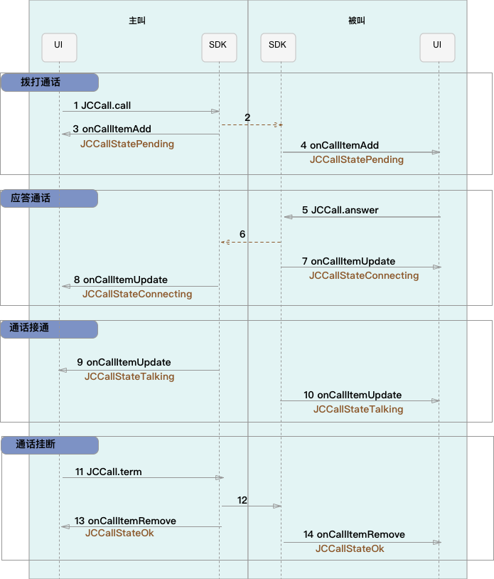

Windows
==============================

.. _一对一视频通话-Windows:

业务集成
---------------------------

准备工作
>>>>>>>>>>>>>>>>>>>>>>>>>>>>>>>>>>

开始之前，请您先做好如下准备工作：

- `Windows SDK 下载 <http://developer.juphoon.com/document/cloud-communication-windows-sdk#2>`_

- :ref:`Windows SDK 配置和初始化<Windows SDK 配置和初始化>`

- :ref:`Windows 登录<Windows 登录>`

如果您已经做好相关准备工作，即可继续以下的内容。

业务集成
>>>>>>>>>>>>>>>>>>>>>>>>>>>>>>>>>>

一对一通话涉及以下类：

.. list-table::
   :header-rows: 1

   * - 名称
     - 描述
   * - JCCall
     - 通话类，包含一对一语音和视频通话功能
   * - JCCallItem
     - 通话对象类，此类主要记录通话的一些状态，UI 可以根据其中的状态进行显示逻辑
   * - JCCallCallback
     - 通话回调接口
   * - JCMediaDevice
     - 设备模块，主要用于视频、音频设备的管理
   * - JCMediaDeviceVideoCanvas
     - 视频对象，主要用于 UI 层视图显示、渲染的控制

接口的详细信息请参考 `API 说明文档 <http://developer.juphoon.com/portal/reference/windows/html/e36ffb00-647f-0198-a895-56556009f19d.htm>`_ 。

*接口调用逻辑和相关状态*

*说明：黑色字体表示接口，棕色字体表示通话状态*

.. note::

    通话方向（呼入或呼出）及通话状态（振铃、连接中、通话中等）可通过 `JCCallItem <http://developer.juphoon.com/portal/reference/windows/html/0267696e-79ee-8d46-c086-3c071a2b2b3a.htm>`_  对象中的 `direction <http://developer.juphoon.com/portal/reference/windows/html/024186ef-6f0d-a89a-ac66-56f82874fc43.htm>`_ 和 `state <http://developer.juphoon.com/portal/reference/windows/html/bf54b32e-b6cc-7192-4119-6d0e603d6967.htm>`_ 获得。

.. highlight:: csharp

**开始集成通话功能前，请先进行** ``模块的初始化``
::

    // 初始化各模块，因为这些模块实例将被频繁使用，建议声明在单例中
    JCClient client = JCClient.create(app, "your appkey", this, null);           
    JCMediaDevice mediaDevice = JCMediaDevice.create(client, this);               
    JCCall call = JCCall.create(client, mediaDevice, this);

其中，创建 JCCall 实例的方法如下
::

    /// 

    /// 创建JCCall实例
    /// 

    /// <param name="client">JCClient实例</param>
    /// <param name="mediaDevice">JCMediaDevice实例</param>
    /// <param name="callback">回调接口，用于接收JCCall相关回调事件</param>
    /// <returns>JCCall实例</returns>
    public static JCCall create(JCClient.JCClient client, JCMediaDevice.JCMediaDevice mediaDevice, JCCallCallback callback)

**开始集成**

**场景一 ：语音通话**

1. 拨打通话

主叫调用下面的接口发起语音通话，此时 video 传入值为 false
::

    /// 

    /// 一对一呼叫
    /// 

    /// <param name="userId">用户标识</param>
    /// <param name="video">是否为视频呼叫</param>
    /// <param name="extraParam">透传参数，设置后被叫方可获取该参数</param>>
    /// <returns>返回true表示正常执行调用流程，false表示调用异常</returns>
    public bool call(string userId, bool video, string extraParam)

.. note:: 

       调用此接口会自动打开音频设备。

       extraParam 为自定义透传字符串，被叫可通过 `JCCallItem <http://developer.juphoon.com/portal/reference/windows/html/0267696e-79ee-8d46-c086-3c071a2b2b3a.htm>`_  对象中的 `extraParam <http://developer.juphoon.com/portal/reference/windows/html/e0226cbc-1ca1-ef9c-5e8e-d3dc853d618d.htm>`_ 属性获得。

示例代码
::

    call.call("peer number", false, "自定义透传字符串");

通话发起后，主叫和被叫均会收到新增通话的回调
::

    /// 

    /// 新增通话回调
    /// 

    /// <param name="item">JCCallItem对象</param>
    void onCallItemAdd(JCCallItem item);

示例代码::

    public void onCallItemAdd(JCCallItem item)
        {
          // 收到新增通话回调
        }

2. 应答通话

被叫收到 onCallItemAdd 回调事件，并通过 JCCallItem 中的 `video <http://developer.juphoon.com/portal/reference/windows/html/19f4b28d-7c00-3f7e-ace5-0615f5b609b3.htm>`_ 属性以及 `direction <http://developer.juphoon.com/portal/reference/windows/html/024186ef-6f0d-a89a-ac66-56f82874fc43.htm>`_ 属性值 In 判断是视频呼入还是语音呼入，此时可以调用下面的接口进行应答，**语音通话只能进行语音应答**
::

    /// 

    /// 接听
    /// 

    /// <param name="item">JCCallItem对象</param>
    /// <param name="video">针对视频呼入可选择视频接听和音频接听</param>
    /// <returns>成功失败</returns> 
    public bool answer(JCCallItem item, bool video)

示例代码::

    public void onCallItemAdd(JCCallItem item) {
        // 如果是语音呼入且在振铃中
        if (item.direction == JCCallDirection.In && !item.video) {
        // 应答通话
        call.answer(item, false);
        }
    }

3. 通话建立

被叫接听通话后，双方将建立连接，此时，主叫和被叫都将会收到通话更新的回调，连接成功之后，通话将建立。

现在您可以进行一对一语音通话了。

如果已经在语音通话中，但又有新通话进来，可以选择接听或挂断，如果选择接听，则原来的一路通话将被保持。

^^^^^^^^^^^^^^^^^^^^^^^^^^^^^^^

**场景二 ：视频通话**

1. 拨打通话

主叫通过 UI 调用以下接口发起视频通话，此时 video 传入值为 true
::

    /// 

    /// 一对一呼叫
    /// 

    /// <param name="userId">用户标识</param>
    /// <param name="video">是否为视频呼叫</param>
    /// <param name="extraParam">透传参数，设置后被叫方可获取该参数</param>>
    /// <returns>返回true表示正常执行调用流程，false表示调用异常</returns>
    public bool call(string userId, bool video, string extraParam)

.. note:: 

       调用此接口会自动打开音频设备。

       extraParam 为自定义透传字符串，被叫可通过 `JCCallItem <http://developer.juphoon.com/portal/reference/windows/html/0267696e-79ee-8d46-c086-3c071a2b2b3a.htm>`_  对象中的 `extraParam <http://developer.juphoon.com/portal/reference/windows/html/e0226cbc-1ca1-ef9c-5e8e-d3dc853d618d.htm>`_ 属性获得。

示例代码::

    // 初始化各模块，因为这些模块实例将被频繁使用，建议声明在单例中
    JCClient client = JCClient.create(app, "your appkey", this, null);           
    JCMediaDevice mediaDevice = JCMediaDevice.create(client, this);               
    JCCall call = JCCall.create(client, mediaDevice, this);
    call.call("peer number", true, "自定义透传字符串");

通话发起后，主叫和被叫均会收到新增通话的回调
::

    /// 

    /// 新增通话回调
    /// 

    /// <param name="item">JCCallItem对象</param>
    void onCallItemAdd(JCCallItem item);

示例代码::

    public void onCallItemAdd(JCCallItem item)
        {
          // 收到新增通话回调
        }

**创建本地视图画面**

通话发起后，即可调用 JCMediaDevice 类中的 :ref:`startCameraVideo<创建本地视图画面(windows)>` 方法打开本地视图预览，**调用此方法会打开摄像头**
::

    /// 

    /// 获取预览视频对象，通过此对象能获得视图用于UI显示
    /// 

    /// <param name="camera">摄像头对象</param>
    /// <param name="mode">渲染方式</param>
    /// <returns>JCMediaDeviceVideoCanvas对象</returns>
    public JCMediaDeviceVideoCanvas startCameraVideo(JCMediaDeviceCamera camera, JCMediaDeviceRenderMode mode)

示例代码::

    // 发起视频呼叫
    call.call("peer number", true, null);
    // 创建本地视图画面
    JCMediaDeviceVideoCanvas loacalCanvas = mediaDevice.startCameraVideo(mediaDevice.cameraDevices[0], JCMediaDevice.JCMediaDeviceRenderMode.FULLCONTENT);
    ImageBrush image = new ImageBrush(loacalCanvas.videoView);
    image.Stretch = Stretch.Uniform;
    this.smVideoGrid.Background = image;

2. 应答通话

被叫收到 onCallItemAdd 回调，并通过 JCCallItem 中的 `video <http://developer.juphoon.com/portal/reference/windows/html/19f4b28d-7c00-3f7e-ace5-0615f5b609b3.htm>`_ 属性以及 `direction <http://developer.juphoon.com/portal/reference/windows/html/024186ef-6f0d-a89a-ac66-56f82874fc43.htm>`_  属性值 In 判断是视频呼入还是语音呼入，此时被叫可以调用以下接口选择视频应答或者语音应答
::

    /// 

    /// 接听
    /// 

    /// <param name="item">JCCallItem对象</param>
    /// <param name="video">针对视频呼入可选择视频接听和音频接听</param>
    /// <returns>返回true表示正常执行调用流程，false表示调用异常</returns>
    public bool answer(JCCallItem item, bool video)

如果被叫应答通话成功，双方都会收到 onCallItemUpdate 的回调。

示例代码::

    public void onCallItemAdd(JCCallItem item) {
        // 如果是视频呼入且在振铃中
        if (item.direction == JCCallDirection.In && item.video) {
            // 应答通话
            call.answer(item, true);
        }
    }

3. 通话建立

被叫接听通话后，双方将建立连接，此时，主叫和被叫都将会收到通话更新的回调（onCallItemUpdate）。连接成功之后，可以进行远端视图的渲染。

**创建远端视图画面**

远端视频画面的获取通过调用 JCMediaDevice 类中的 :ref:`startVideo<创建远端视图画面(windows)>` 方法实现 
::

    /// 

    /// 获得视频对象，通过此对象能获得视图用于UI显示
    /// 

    /// <param name="videoSource">渲染标识串，比如JCMediaChannelParticipant JCCallItem中的renderId</param>
    /// <param name="mode">渲染模式</param>
    /// <returns>JCMediaDeviceVideoCanvas对象</returns>
    public JCMediaDeviceVideoCanvas startVideo(string videoSource, JCMediaDeviceRenderMode mode)

现在您可以进行一对一视频通话了。

示例代码::

    public void onCallItemUpdate(JCCallItem item) {
        // 如果对端在上传视频流（uploadVideoStreamOther）
        if (item.state == JCCallState.Talking && item.uploadVideoStreamOther && remoteCanvas == null) { 
            // 创建远端视频画面对象，renderId来源JCCallItem对象         
            JCMediaDeviceVideoCanvas remoteCanvas = mediaDevice.startVideo(item.renderId, JCMediaDevice.JCMediaDeviceRenderMode.FULLSCREEN);
            ImageBrush image = new ImageBrush(remoteCanvas.videoView);
            image.Stretch = Stretch.Uniform;
            this.smVideoGrid.Background = image;
        }
    }

4. 挂断通话

主叫或者被叫均可以调用下面的方法挂断通话
::

    /// 

    /// 挂断
    /// 

    /// <param name="item">JCCallItem对象</param>
    /// <param name="reason">挂断原因，参考</param>
    /// <param name="description">挂断描述</param>
    /// <returns>返回true表示正常执行调用流程，false表示调用异常</returns>
    public bool term(JCCallItem item, JCCallReason reason, string description)

示例代码
::

    // 挂断通话
    JCCallItem item = call.callItems[0];
    call.term(item, JCCallReason.TermBySelf, "挂断");

如果是视频通话，则在通话挂断后需要调用 :ref:`stopVideo<销毁本地和远端视图画面(windows)>` 接口移除视频画面
::

    /// 

    /// 停止视频
    /// 

    /// <param name="canvas">JCMediaDeviceVideoCanvas对象，由startVideo获得</param>
    public void stopVideo(JCMediaDeviceVideoCanvas canvas)

通话挂断后，UI 会收到移除通话的回调
::

    /// 

    /// 移除通话回调
    /// 

    /// <param name="item">JCCallItem对象</param>
    /// <param name="reason">通话结束原因</param>
    void onCallItemRemove(JCCallItem item, JCCallReason reason);

示例代码
::

    public void onCallItemRemove(JCCallItem item, JCCallReason reason)
    {
        // 移除视频画面
    }

其中，reason 有以下几种

.. list-table::
   :header-rows: 1

   * - 名称
     - 描述
   * - None
     - 无异常
   * - NotLogin
     - 未登录
   * - CallFunctionError
     - 函数调用错误
   * - TimeOut
     - 超时
   * - NetWorkError
     - 网络错误
   * - CallOverLimit
     - 超出通话上限
   * - TermBySelf
     - 自己挂断
   * - AnswerFail
     - 应答失败
   * - Busy
     - 忙
   * - Decline
     - 拒接
   * - UserOffline 
     - 用户不在线
   * - NotFound
     - 无此用户
   * - Other = 100
     - 其他错误

**更多功能**

- :ref:`通话状态更新<通话状态更新(windows1-1)>`

- :ref:`通话过程控制<通话过程控制(windows1-1)>`

- :ref:`获取网络状态<获取网络状态(windows1-1)>`

- :ref:`设备控制<设备控制(windows)>`

**进阶**

在实现音视频通话的过程中，您可能还需要添加以下功能来增强您的应用：

- :ref:`通话录音<通话录音(windows)>`

- :ref:`视频通话录制<视频通话录制(windows)>`

- :ref:`截屏<截屏(windows)>`

- :ref:`发送消息<发送消息(windows1)>`

- :ref:`涂鸦<涂鸦(windows)>`

- :ref:`推送<推送(windows)>`