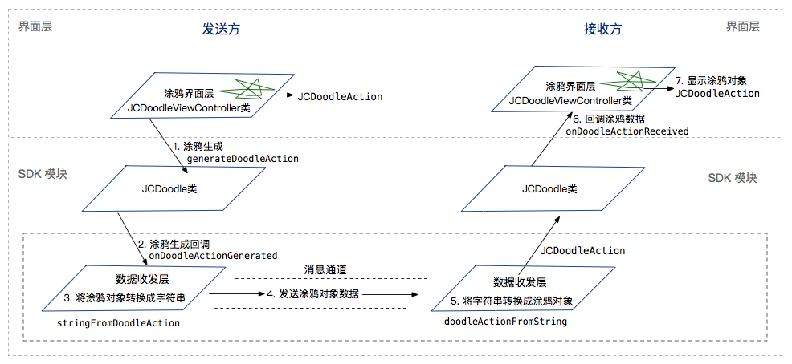

Android
--------------------

.. highlight:: java

涂鸦模块包含涂鸦组件和涂鸦控件，您可以使用我们的涂鸦控件，也可以自定义涂鸦控件，无论您是使用我们的控件还是自定义控件，都只需将界面控件和 SDK 绑定并完成数据收发层的集成即可，下面将介绍涂鸦模块的集成操作。

开始之前，先下载 `SDK <http://developer.juphoon.com/document/cloud-communication-android-sdk#2>`_ 。

涂鸦涉及 `JCDoodle 类 <http://developer.juphoon.com/portal/reference/android/com/juphoon/cloud/JCDoodle.html>`_ 、JCDoodleCallback 类、 `JCDoodleInteractor 类 <http://developer.juphoon.com/portal/reference/android/com/juphoon/cloud/JCDoodleInteractor.html>`_ 和 `JCDoodleAction 类 <http://developer.juphoon.com/portal/reference/android/com/juphoon/cloud/JCDoodleAction.html>`_ 。

具体请参考 `API 说明文档 <http://developer.juphoon.com/portal/reference/android/>`_。

涂鸦模块的调用逻辑如下图所示：

**开始集成**

1. 创建涂鸦对象

::

    /**
     * 创建 JCDoodle 对象。
     *
     * @param callback {@link JCDoodleCallback} 回调接口，用于接收未处理或自定义的
     *                 {@link JCDoodleAction}。
     * @return 返回 JCDoodle 对象。
     */
    public static JCDoodle create(JCDoodleCallback callback) 

示例代码::

    JCDoodle doodle = JCDoodle.create(this);

2. 绑定 Doodle UI 控件

您可以调用 bindDoodleInteractor 接口将 UI 控件和 SDK 进行绑定
::

    /**
     * 绑定 Doodle UI 控件
     *
     * @param interactor UI 控件实例
     */
    public abstract void bindDoodleInteractor(JCDoodleInteractor interactor);

示例代码::

    JCDoodle doodle = JCDoodle.create(this);
    doodle.bindDoodleInteractor(interactor);

3.将涂鸦数据注入 SDK

当界面层产生涂鸦数据后，调用 generateDoodleAction 接口将涂鸦动作对象注入 SDK
::

    /**
     * 将 UI 控件产生的 {@link JCDoodleAction} 注入 SDK。
     * 

     * SDK 会通过 {@link JCDoodleCallback#onDoodleActionGenerated(JCDoodleAction)} 回调此 Doodle 动作。
     * 本方法仅供 UI 控件调用。
     *
     * @param doodleAction Doodle 动作。
     */
    public abstract void generateDoodleAction(JCDoodleAction doodleAction);

示例代码::

    JCDoodle doodle = JCDoodle.create(this);
    // action 为 JCDoodleAction 对象，指代具体的涂鸦动作
    doodle.generateDoodleAction(action);

4.实现 JCDoodleCallback 的回调

界面层产生涂鸦数据后，SDK 会收到 onDoodleActionGenerated 回调
::

    /**
     * 涂鸦回调
     *
     * @param doodleAction {@link JCDoodleAction} 对象，用户可以调用
     * {@link JCDoodle#stringFromDoodleAction(JCDoodleAction)} 将其转为 {@link String} 后通过消息通道发送。
     */
    void onDoodleActionGenerated(JCDoodleAction doodleAction);

5.涂鸦数据处理和发送

回调的涂鸦数据需要在数据收发层进行处理（把 doodleAction 对象转为 String）
::

    /**
     * 将 {@link JCDoodleAction} 转化为 {@link String}。转换后的字符串可以用于数据传输。
     *
     * @param doodleAction Doodle 动作。
     * @return Doodle 动作对应的 {@link String}。
     * 可通过 {@link JCDoodle#doodleActionFromString(String)} 转换回对应的 {@link JCDoodleAction}
     */
    public abstract String stringFromDoodleAction(JCDoodleAction doodleAction);

涂鸦数据转换完成后，即可调用相应的数据传输通道发送涂鸦数据

::

    public void onDoodleActionGenerated(JCDoodleAction doodleAction) {
        JCDoodle doodle = JCDoodle.create(this);
        // doodleAction 为 JCDoodleAction 对象，指代具体的涂鸦动作
        String action = JCDoodle.stringFromDoodleAction(doodleAction);
        // 发送涂鸦数据
        JCManager.getInstance().call.sendMessage("发送的消息对象", "消息类型", action);
    }

6.接收涂鸦数据

涂鸦数据发送后，接收方需要在数据收发层完成字符串转换成 JCDoodleAction 对象的操作

接收方数据收发层收到字符串消息并通过 doodleActionFromString 将其转换为 JCDoodleAction 对象
::

    /**
     * 解析涂鸦数据。收到 {@link String} 数据后调用此接口，若数据的类型符合，其将转化为 {@link JCDoodleAction}，
     * 并通过 {@link JCDoodleInteractor#onDoodleReceived(JCDoodleAction)} 回调至 UI 控件用于渲染。
     * 若数据类型不符合，则返回 null。
     *
     * @param doodleActionData Doodle 动作对应的 {@link String}
     * @return Doodle 动作。
     */
    public abstract JCDoodleAction doodleActionFromString(String doodleActionData);

示例代码::

    JCDoodle doodle = JCDoodle.create(this);
    // 涂鸦数据字符串
    JCDoodleAction doodleAction = doodle.doodleActionFromString(action);

数据收发层解析涂鸦数据后，涂鸦界面层通过 onDoodleReceived 回调涂鸦数据
::

    /**
     * 向 UI 控件回调收到的 {@link JCDoodleAction}，该回调由用户收到涂鸦数据后调用
     * {@link JCDoodle#doodleActionFromString(String)} 触发。
     *
     * @param doodleAction {@link JCDoodleAction} 对象。
     */
    void onDoodleReceived(JCDoodleAction doodleAction);

::

    public void onDoodleReceived(JCDoodleAction doodleAction) 
    {
        int actionType = doodleAction.getActionType();
        if (actionType == JCDoodle.ACTION_DRAW || actionType == JCDoodle.ACTION_ERASER) {
            // 界面展示处理
            ...
        }
    }

以上步骤完成后，即可完成涂鸦的集成。更多信息请参考我们的 Demo。