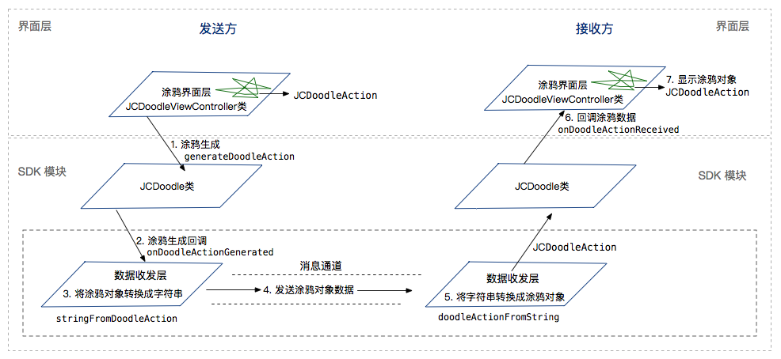

iOS
=========================

.. highlight:: objective-c

涂鸦模块包含涂鸦组件和涂鸦控件，您可以使用我们的涂鸦控件，也可以自定义涂鸦控件，无论您是使用我们的控件还是自定义控件，都只需将界面控件和 SDK 绑定并完成数据收发层的集成即可，下面将介绍涂鸦模块的集成操作。

开始之前，先下载 `SDK <http://developer.juphoon.com/document/cloud-communication-ios-sdk#2>`_ 。

涂鸦涉及 `JCDoodle 类 <http://developer.juphoon.com/portal/reference/ios/Classes/JCDoodle.html>`_ 、`JCDoodleCallback 类 <http://developer.juphoon.com/portal/reference/ios/Protocols/JCDoodleCallback.html>`_ 、`JCDoodleInteractor 协议 <http://developer.juphoon.com/portal/reference/ios/Protocols/JCDoodleInteractor.html>`_ 和 `JCDoodleAction 类 <http://developer.juphoon.com/portal/reference/ios/Classes/JCDoodleAction.html>`_ 。

具体请参考 `API 说明文档 <http://developer.juphoon.com/portal/reference/ios/>`_ 。

涂鸦模块的调用逻辑如下图所示：

**开始集成**

1. 创建涂鸦对象
::

    /**
     *  @brief 创建 JCDoodle 对象
     *  @param callback JCDoodleCallback 回调对象
     *  @return 返回 JCDoodle 对象
     */
    + (JCDoodle *)create:(id<JCDoodleCallback>)callback;

示例代码::

    JCDoodle *doodle = [JCDoodle create:self];

2.绑定 Doodle UI 控件

您可以调用 bindDoodleInteractor 接口将 UI 控件和 SDK 进行绑定

::

    /**
     *  @brief 绑定 Doodle UI 控件
     *  @param interactor 实现<JCDoodleInteractor>的 UI 控件实例
     *
     */
    - (void)bindDoodleInteractor:(id<JCDoodleInteractor>)interactor;

示例代码::

    JCDoodle *doodle = [JCDoodle create:self];
    [doodle bindDoodleInteractor:self];

3.将涂鸦数据注入 SDK

当界面层产生涂鸦数据后，调用 generateDoodleAction 接口将涂鸦动作对象注入 SDK
::

    /**
     *  @brief 将 UI 控件产生的 JCDoodleAction 对象注入 SDK。SDK 会通过 onDoodleActionGenerated 回调 doodleAction 对象。
     *  本方法仅供 UI 控件调用。
     *
     *  @param doodleAction 交付的涂鸦对象
     *
     */
    - (void)generateDoodleAction:(JCDoodleAction *)doodleAction;

示例代码::

    JCDoodle *doodle = [JCDoodle create:self];
    JCDoodleAction *doodleAction = [[JCDoodleAction alloc] init];
    doodleAction.actionType = JCDoodleActionClear;
    [doodle generateDoodleAction:doodleAction];

4. 实现 JCDoodleCallback 的回调

界面层产生涂鸦数据后，SDK 会收到 onDoodleActionGenerated 回调

::

    /**
     *  @brief 涂鸦回调
     *  @param doodleAction JCDoodleAction对象
     *
     */
     - (void)onDoodleActionGenerated:(JCDoodleAction *)doodleAction;

5. 涂鸦数据处理和发送

回调的涂鸦数据需要在数据收发层进行处理（把 doodleAction 对象转为 String）
::

    /**
     *  @brief 把JCDoodleAction对象转换成字符串，转换后的字符串可用于数据传输。
     *  @param doodleAction 不能为nil
     *  @return 字符串
     */
    - (nullable NSString *)stringFromDoodleAction:(JCDoodleAction *)doodleAction;

涂鸦数据转换完成后，即可调用相应的数据传输通道发送涂鸦数据

::

    - (void)onDoodleActionGenerated:(JCDoodleAction *)doodleAction {
        JCDoodle *doodle = [JCDoodle create:self];
        JCDoodleAction *doodleAction = [[JCDoodleAction alloc] init];
        doodleAction.actionType = JCDoodleActionClear;
        // 把涂鸦数据转换成字符串
        NSString *str = [doodle stringFromDoodleAction:doodleAction];
        // 发送涂鸦数据
        [[JCManager shared].call sendMessage:@"当前通话对象" type:@"消息类型" content:str];
    }

.. note:: 在一对一通话中可通过消息通道（JCMessageChannel）发送涂鸦数据；在会议中可通过媒体频道（JCMediaChannel）发送涂鸦数据。

6. 接收涂鸦数据

涂鸦数据发送后，接收方需要在数据收发层完成字符串转换成 JCDoodleAction 对象的操作

::

    /**
     *  @brief 把字符串转换成JCDoodleAction对象。
     *  @param doodleActionData 必须是用stringFromDoodleAction接口转换的字符串
     *  @return JCDoodleAction对象，当 doodleActionData 不符合条件时返回为空
     *
     */
    - (nullable JCDoodleAction *)doodleActionFromString:(NSString *)doodleActionData;

示例代码::

    JCDoodle *doodle = [JCDoodle create:self];
    JCDoodleAction *doodleAction = [doodle doodleActionFromString:@"涂鸦字符串"];

涂鸦数据转换操作完成后会触发 onDoodleActionReceived 回调，UI 控件通过该方法回调收到的 JCDoodleAction 对象
::

    /**
     *  @brief 向 UI 控件回调收到的JCDoodleAction对象，该回调由用户收到涂鸦数据后调用 doodleActionFromString 接口触发。
     *  @param doodleAction JCDoodleAction对象
     */
    - (void)onDoodleActionReceived:(JCDoodleAction *)doodleAction;

以上步骤完成后，即可完成涂鸦的集成。更多信息请参考我们的 Demo。