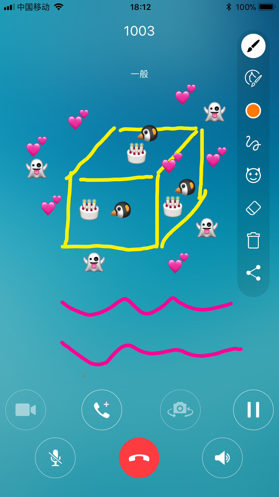

简介
-------------------

涂鸦作为一种特殊的沟通和表达的方式，深受大众喜爱，通过集成涂鸦功能，能够极大的拓展沟通的方式，增强聊天的趣味性，让聊天有聊更有料。

**产品优势**

- 功能丰富。支持画笔和贴图涂鸦，画笔颜色随意选择，贴图包内容丰富，让您随心所欲的涂鸦。

- 响应及时。本地涂鸦的内容将实时显现在对端的设备上，让沟通无延时，更自然。

- 应用场景丰富。可用于聊天、会议以及教育等多种业务场景。

- 跨平台支持。支持 iOS、Android 和 Windows 平台，接口简洁，易于集成。

