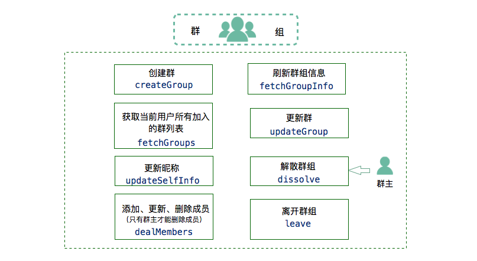

Windows 群组集成
===============================

.. highlight:: csharp

准备工作
---------------------------

开始之前，请您先做好如下准备工作：

- `Windows 版 SDK 下载 <http://developer.juphoon.com/document/cloud-communication-windows-sdk#2>`_

- :ref:`Windows SDK 配置和初始化<Windows SDK 配置和初始化>`

- :ref:`Windows 登录<Windows 登录>`

如果您已经做好相关准备工作，即可继续以下的内容。

业务集成
----------------------------------

群组涉及群组实例类（JCGroupItem）和群组成员类（JCGroupMember）。

JCGroupItem 有以下属性：

.. list-table::

   * - 群组标识
     - string groupId
   * - 群组名称
     - string name
   * - 群组变化状态
     - JCGroupChangeState changeState

JCGroupMember 有以下属性：

.. list-table::

   * - 群组标识
     - string groupId
   * - 用户标识
     - string userId
   * - 服务器端用户标识
     - string uid
   * - 用户昵称
     - string displayName
   * - 角色类型，参见 JCGroupMemberType
     - JCGroupMemberType memberType
   * - 成员改变状态，参见 JCGroupChangeState
     - JCGroupChangeState changeState

群成员类型（JCGroupMemberType）有以下三种：

.. list-table::

   * - 拥有者
     - Owner
   * - 管理者
     - Manager
   * - 群成员
     - Member

**群组集成**

**开始集成群组功能前，请先进行** ``模块的初始化``
::

    // 初始化各模块，因为这些模块实例将被频繁使用，建议声明在单例中
    JCClient client = JCClient create(app, "your appkey", this, null);
    JCGroup group = JCGroup create(client, this);

其中，创建 JCGroup 实例的方法如下
::

    /// 

    /// 创建JCGroup对象
    /// 

    /// <param name="client">JCClient对象</param>
    /// <param name="callback">JCGroupCallback回调，用于接收 JCGroup 相关通知</param>
    /// <returns>JCGroup对象</returns>
    public static JCGroup create(JCClient.JCClient client, JCGroupCallback callback)

**开始集成**

**群组管理**

1. 创建群
::

    /// 

    /// 创建群
    /// 

    /// <param name="members">群成员</param>
    /// <param name="groupName">群名称</param>
    /// <returns>操作Id</returns>
    public int createGroup(List<JCGroupMember> members, string groupName);

示例代码::

    JCGroupMember jgm = new JCGroupMember("test", client.userId, client.displayName, JCGroupMemberType.Owner, JCGroupChangeState.None);
    List<JCGroupMember> mGroupMembers = new List<JCGroupMember>();
    mGroupMembers.Add(jgm);
    group.createGroup(mGroupMembers, groupName);

创建群回调
::

    /// 

    /// 创建群回调
    /// 

    /// <param name="operationId">操作标识</param>
    /// <param name="result">成功失败</param>
    /// <param name="reason">当result为false时有效</param>
    /// <param name="groupItem">JCGroupItem 对象</param>
    void onCreateGroup(int operationId, bool result, JCGroupReason reason, JCGroupItem groupItem);

其中，JCGroupReason 有以下几种：

.. list-table::

   * - 正常
     - None
   * - 未登录
     - NotLogin
   * - 函数调用失败
     - CallFunctionError
   * - 超时
     - TimeOut
   * - 网络异常
     - NetWork
   * - 其他错误
     - Other
   * - 参数错误
     - ParamInvalid

2. 获取群列表
::

    /// 

    /// 获取当前用户所有加入的群列表，结果通过 JCGroupCallback 中相应回调返回
    /// 

    /// <param name="updateTime">最新一次记录的群列表服务器更新时间</param>
    /// <returns>操作Id</returns>
    public int fetchGroups(long updateTime);

示例代码::

    group.fetchGroups(updateTime);

拉取群列表结果回调
::

    /// 

    /// 拉取群列表结果回调
    /// 

    /// <param name="operationId">操作标识</param>
    /// <param name="result">成功失败</param>
    /// <param name="reason">当result为false时有效</param>
    /// <param name="groups">群列表</param>
    /// <param name="updateTime">服务器更新时间</param>
    /// <param name="fullUpdate">是否全更新</param>
    void onFetchGroups(int operationId, bool result, JCGroupReason reason, List<JCGroupItem> groups, long updateTime, bool fullUpdate);

当群列表发生了改变，会收到 onGroupListChange 回调，此时可以调用 fetchGroups 接口获取更新
::

    /// 

    /// 群列表更新，调用JCGroup fetchGroups获取更新
    /// 

    void onGroupListChange();

3. 获取群信息
::

    /// 

    /// 刷新群组信息
    /// 

    /// <param name="groupId">群标识</param>
    /// <param name="updateTime">最新一次记录的群服务器更新时间</param>
    /// <returns>操作Id</returns>
    public int fetchGroupInfo(string groupId, long updateTime);

示例代码::

    group.fetchGroupInfo(groupId, updatetime);

拉取群详情结果回调
::

    /// 

    /// 拉取群详情结果回调
    /// 

    /// <param name="operationId">操作标识</param>
    /// <param name="result">成功失败</param>
    /// <param name="reason">result为false时有效</param>
    /// <param name="groupItem">JCGroupItem对象</param>
    /// <param name="members">成员列表</param>
    /// <param name="updateTime">服务器更新时间</param>
    /// <param name="fullUpdate">是否全更新</param>
    void onFetchGroupInfo(int operationId, bool result, JCGroupReason reason, JCGroupItem groupItem, List<JCGroupMember> members, long updateTime, bool fullUpdate);

当群信息发生了改变，会收到 onGroupInfoChange 回调，此时可以调用 fetchGroupInfo 接口获取更新
::

    /// 

    /// 群详情更新，调用JCGroup fetchGroupInfo获取更新
    /// 

    /// <param name="groupId"></param>
    void onGroupInfoChange(string groupId);

4. 添加、更新和删除群成员
::

    /// 

    /// 增加，更新，删除成员
    /// 

    /// <param name="groupId">群标识</param>
    /// <param name="members">JCGroupMember 对象列表，通过changeState值来表明增加，更新，删除成员操作</param>
    /// <returns>操作Id</returns>
    public int dealMembers(string groupId, List<JCGroupMember> members);

.. note:: 只有群主才可以删除成员。

其中，群变化状态（JCGroupChangeState）有以下几种：

.. list-table::

   * - 无
     - None
   * - 新增
     - Add
   * - 更新
     - Update
   * - 删除
     - Remove

示例代码::

    List<JCGroupMember> addMemberlist = new List<JCGroupMember>();
    JCGroupMember member = new JCGroupMember(groupid, userId, displayName, JCGroupMemberType.Member, JCGroupChangeState.Add);
    addMemberlist.Add(member);
    JCManager.shared().group.dealMembers(groupid, addMemberlist);

dealMembers 结果回调
::

    /// 

    /// dealMembers 结果回调
    /// 

    /// <param name="operationId">操作标识</param>
    /// <param name="result">成功失败</param>
    /// <param name="reason">当result为false时有效</param>
    void onDealMembers(int operationId, bool result, JCGroupReason reason);

5. 修改昵称
::

    /// 

    /// 更新昵称
    /// 

    /// <param name="selfInfo">JCGroupMember对象，请传入groupId，displayName，memberType</param>
    /// <returns>操作Id</returns>
    public int updateSelfInfo(JCGroupMember selfInfo);

示例代码::

    JCGroupMember selfinfo = new JCGroupMember(groupId, userId, displayName, JCGroupMemberType.Member, JCGroupChangeState.Update);
    group.updateSelfInfo(selfinfo);

6. 更新群、修改群名称
::

    /// 

    /// 更新群
    /// 

    /// <param name="groupItem">JCGroupItem对象，changeState值不影响操作</param>
    /// <returns>操作Id</returns>
    public int updateGroup(JCGroupItem groupItem);

示例代码::

    JCGroupItem item = new JCGroupItem(groupId,userId,JCGroupChangeState.Update);
    group.updateGroup(item);

更新群信息调用回调
::

    /// 

    /// 更新群信息调用回调
    /// 

    /// <param name="operationId">操作标识</param>
    /// <param name="result">成功失败</param>
    /// <param name="reason">当result为false时有效</param>
    /// <param name="groupId">群标识</param>
    void onUpdateGroup(int operationId, bool result, JCGroupReason reason, string groupId);

7. 离开群组
::

    /// 

    /// 离开群组
    /// 

    /// <param name="groupId">群标识</param>
    /// <returns>操作Id</returns>
    public int leave(string groupId);

示例代码::

    group.leave(groupId);

离开群组结果调用回调
::

    /// 

    /// 离开群组调用回调
    /// 

    /// <param name="operationId">操作标识</param>
    /// <param name="result">成功失败</param>
    /// <param name="reason">当result为false时有效</param>
    /// <param name="groupId">群标识</param>
    void onLeaveGroup(int operationId, bool result, JCGroupReason reason, string groupId);

8. 解散群组
::

    /// 

    /// 解散群组，Owner才能解散群组
    /// 

    /// <param name="groupId">群标识</param>
    /// <returns>操作Id</returns>
    public int dissolve(string groupId);

示例代码::

    group.dissolve(groupId);

解散群组调用回调
::

    /// 

    /// 解散群组调用回调
    /// 

    /// <param name="operationId">操作标识</param>
    /// <param name="result">成功失败</param>
    /// <param name="reason">当result为false时有效</param>
    /// <param name="groupId">群标识</param>
    void onDissolve(int operationId, bool result, JCGroupReason reason, string groupId);

**收发群组消息**

在群组中发送和接收消息参见 :ref:`消息<消息>`。