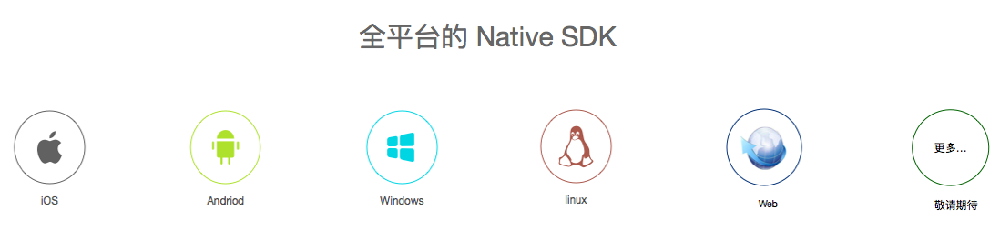

.. 菊风云通讯平台 documentation master file, created by
   sphinx-quickstart on Sat Sep 16 21:38:51 2017.
   You can adapt this file completely to your liking, but it should at least
   contain the root `toctree` directive.

欢迎来到菊风云通讯平台!
-------------------------

菊风云通讯平台为您提供一对一和多方音视频通话以及即时消息、推送、涂鸦等服务，利用菊风丰富的行业经验和独家专利技术，为您的应用带来极致的体验。

在这里您将学习如何集成菊风云通讯平台的 SDK。让我们开启音视频集成开发之旅吧！

**Juphoon  Cloud  Platform  SDK - Usable , Elegent !**
  

目录
==================================

.. toctree::
   :maxdepth: 1
   
   新手入门 <newguide/index.rst>
   产品介绍<newguide/productintroduce>
   体验 Demo <demo/index>
   多方通话 <multicall/index>
   一对一通话 <1-1call/index>
   WebRTC 通话 <webrtc/index>
   SIP 电话 <sip/index>
   即时消息(Beta) <message/index>
   推送 <push/index>
   涂鸦 <doodle/index>
   群组(Beta) <group/index>
   文件存储(Beta)<storage/index>