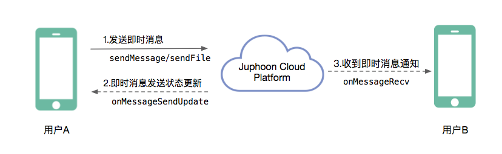

Android
===============================

.. highlight:: java

准备工作
---------------------------

开始之前，请您先做好如下准备工作：

- `Android 版 SDK 下载 <http://developer.juphoon.com/document/cloud-communication-android-sdk#2>`_

- :ref:`Android SDK 配置和初始化<Android SDK 配置和初始化>`

- :ref:`Android 登录<Android 登录>`

如果您已经做好相关准备工作，即可继续以下的内容。

业务集成
----------------------------------

即时消息集成涉及到即时消息对象类(JCMessageChannelItem)及其属性：

.. csv-table::
   :file: message-android.csv

消息类型(Type)有以下几种：
::

    /**
     * 一对一消息
     */
    public static final int TYPE_1TO1 = 0;
    /**
     * 群组消息
     */
    public static final int TYPE_GROUP = 1;

消息传输方向(ItemDirection)有：
::

    /**
     * 发送
     */
    public static final int DIRECTION_SEND = 0;
    /**
     * 接收
     */
    public static final int DIRECTION_RECEIVE = 1;

**消息集成**

**开始集成消息功能前，请先进行** ``模块的初始化``
::

    // 初始化各模块，因为这些模块实例将被频繁使用，建议声明在单例中
    JCClient client = JCClient.create(Context, "your appkey", this, null);
    JCMessageChannel messageChannel = JCMessageChannel.create(client, this);

其中，创建 JCMessageChannel 实例的方法如下
::

    /**
     * 创建 JCMessageChannel 对象
     *
     * @param client   JCClient 对象
     * @param callback JCMessageChannelCallback 回调接口，用于接收 JCMessageChannel 相关通知
     * @return 返回 JCMessageChannel 对象
     */
    public static JCMessageChannel create(JCClient client, JCMessageChannelCallback callback)

**开始集成**

消息类型分为两种：文本消息和文件消息。

**发送消息**

假如用户 A 想给用户 B 发送即时消息，则可以调用接口如下：

- 发送文本消息
::

    /**
     * 发送文本消息, 文本内容不要超过10KB
     *
     * @param type        类型，参见 JCMessageChannelType
     * @param keyId       对方唯一标识，当 type 为 JCMessageChannelType1To1 时为用户标识，当 type 为 JCMessageChannelTypeGroup 时为群组标识
     * @param messageType 文本消息类型，用户可以自定义，例如text，xml等
     * @param text        文本内容
     * @param extraParams 自定义参数集
     * @return 返回 JCMessageChannelItem 对象，异常返回 null
     */
    public abstract JCMessageChannelItem sendMessage(@Type int type, String keyId, String messageType, String text,
                                                     Map<String, String> extraParams);

- 发送文件消息
::

    /**
     * 发送文件消息
     *
     * @param type        类型，参见 JCMessageChannelType
     * @param keyId       对方唯一标识，当 type 为 JCMessageChannelType1To1 时为用户标识，当 type 为 JCMessageChannelTypeGroup 时为群组标识
     * @param messageType 文件消息类型，用户可以自定义，例如image，video等
     * @param fileUri     文件链接地址
     * @param thumbPath   缩略图路径，针对视频，图片等消息
     * @param size        文件大小
     * @param duration    文件时长，针对语音，视频等消息
     * @param extraParams 自定义参数集
     * @return 返回 JCMessageChannelItem 对象，异常返回 nil
     */
    public abstract JCMessageChannelItem sendFile(@Type int type, String keyId, String messageType, String fileUri, String thumbPath,
                                                  int size, int duration, Map<String, String> extraParams);

示例代码::

    // 发送文本消息
    JCMessageChannelItem item = messageChannel.sendMessage(JCMessageChannel.TYPE_1TO1, KeyId, "text", content, null);
    // 发送文件消息
     JCMessageChannelItem item = messageChannel.sendFile(JCMessageChannel.TYPE_1TO1, userId, fileType, content, null/*缩略图路径*/, 0/*文件大小*/, 0/*时长*/, null);

A 发送即时消息后，会收到 onMessageSendUpdate 回调
::

    /**
     * 消息发送状态更新
     *
     * @param message IM消息对象，通过该对象可以获得消息的属性及状态
     * @see JCMessageChannelItem
     */
    void onMessageSendUpdate(JCMessageChannelItem message);

其中，消息状态(ItemState)有：

::

    // 消息初始状态
    public static final int ITEM_STATE_INIT = 0;
    // 消息发送中状态
    public static final int ITEM_STATE_SENDING = 1;
    // 消息发送成功状态
    public static final int ITEM_STATE_SENDOK = 2;
    // 消息发送失败状态
    public static final int ITEM_STATE_SENDFAIL = 3;
    // 收到消息
    public static final int ITEM_STATE_RECEIVED = 4;

示例代码::

    public void onMessageSendUpdate(JCMessageChannelItem message) {
        if (message.getState() == JCMessageChannel.ITEM_STATE_SENDING) {
            // 消息发送中
        } else if (message.getState() == JCMessageChannel.MESSAGE_SEND_OK) {
            // 消息发送成功
        } else if (message.getState() == JCMessageChannel.ITEM_STATE_SENDFAIL) {
            // 消息发送失败
        }
    }

如果消息发送失败，原因有以下几种：

::

    // 无异常
    public static final int REASON_NONE = 0;
    // 未登录
    public static final int REASON_NOT_LOGIN = 1;
    // 消息内容太长
    public static final int REASON_TOO_LONG = 2;
    // 其他错误
    public static final int REASON_OTHER = 100;

**接收消息**

即时消息发送成功后，用户 B 会收到 onMessageRecv 回调
::

    /**
     * 收到消息通知
     *
     * @param message IM消息对象，通过该对象可以获得消息的属性及状态
     * @see JCMessageChannelItem
     */
    void onMessageRecv(JCMessageChannelItem message);

示例代码::

    public void onMessageRecv(JCMessageChannelItem message) {
        if (message.getState() == JCMessageChannel.ITEM_STATE_RECEIVED) {
            // 收到消息
        }
    }

