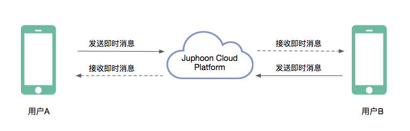

简介
-------------------------

即时消息是 Juphoon Cloud Platform 提供的基础业务,包括一对一即时消息和群组即时消息。

- 一对一即时消息是两个用户进行一对一聊天，消息类型包括文本消息和文件。

- 群组即时消息是指两个以上用户一起聊天，消息类型支持文本息和文件。

**即时消息发送机制**

用户 A 发送即时消息给用户 B。

首先，A 发送的即时消息传给 Juphoon Cloud 服务器，服务器接收 A 发送的即时消息；

服务器将用户 A 发送的即时消息转发给用户 B，用户 B 收到即时消息。

