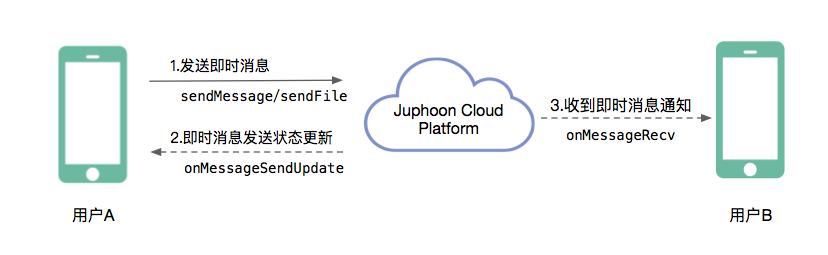

Windows
==============================

.. highlight:: csharp

准备工作
---------------------------

开始之前，请您先做好如下准备工作：

- `Windows 版 SDK 下载 <http://developer.juphoon.com/document/cloud-communication-windows-sdk#2>`_

- :ref:`Windows SDK 配置和初始化<Windows SDK 配置和初始化>`

- :ref:`Windows 登录<Windows 登录>`

如果您已经做好相关准备工作，即可继续以下的内容。

业务集成
---------------------------------

即时消息集成涉及到即时消息对象类(JCMessageChannelItem)及其属性：

.. csv-table::
   :file: message-windows.csv

消息类型(JCMessageChannelType)有以下两种：

::

    // 一对一消息
    oneTOOne,
    // 群组消息
    Group

消息发送方向(JCMessageChannelItemDirection)有：

::

    // 发送
    Send,
    // 接收
    Receive

**即时消息集成**

**开始集成消息功能前，请先进行** ``模块的初始化``
::

    // 初始化各模块，因为这些模块实例将被频繁使用，建议声明在单例中
    JCClient client = JCClient.create(app, "your appkey", this, null);
    JCMessageChannel messageChannel = JCMessageChannel.create(client, this);

其中，创建 JCMessageChannel 实例的方法如下
::

    /// 

    /// 创建JCMessageChannel对象
    /// 

    /// <param name="client">JCClient 对象</param>
    /// <param name="callback">JCMessageChannelCallback 回调接口</param>
    /// <returns>JCMessageChannel对象</returns>
    public static JCMessageChannel create(JCClient.JCClient client, JCMessageChannelCallback callback);

**开始集成**

消息类型分为两种：文本消息和文件消息。

**发送消息**

假如用户 A 想给用户 B 发送即时消息，则可以调用接口如下：

- 发送文本消息
::

    /// 

    /// 发送文本消息
    /// 

    /// <param name="type">JCMessageChannelType</param>
    /// <param name="keyId">对方唯一标识</param>
    /// <param name="messageType">文本消息类型，可自定义，如text，xml</param>
    /// <param name="text">文本内容</param>
    /// <param name="extraParams">自定义参数集</param>
    /// <returns>JCMessageChannelItem 对象</returns>
    public JCMessageChannelItem sendMessage(JCMessageChannelType type, string keyId, string messageType, string text, Dictionary<string,string> extraParams);

- 发送文件消息
::

    /// 

    /// 发送文件
    /// 

    /// <param name="type">JCMessageChannelType</param>
    /// <param name="keyId">对方唯一标识</param>
    /// <param name="messageType">文件类型</param>
    /// <param name="fileUri">文件Uri</param>
    /// <param name="thumbPath">缩略图路径</param>
    /// <param name="size">文件大小</param>
    /// <param name="duration">文件时长</param>
    /// <param name="extraParams">自定义参数集</param>
    /// <returns>JCMessageChannelItem 对象</returns>
    public JCMessageChannelItem sendFile(JCMessageChannelType type, string keyId, string messageType, string fileUri, string thumbPath, int size, int duration, Dictionary<string,string> extraParams);

示例代码::

    // 发送一对一文本消息
    messageChannel.sendMessage(JCMessageChannelType.oneTOOne, keyId, "TEXT", text, null);
    // 发送群组文本消息
    messageChannel.sendMessage(JCMessageChannelType.Group, keyId, "Text", text, null);
    // 发送一对一文件消息
    messageChannel.sendFile(JCMessageChannelType.oneTOOne, keyId, "TEXT", text, null, 0, 0, null);
    // 发送群组文件消息
    messageChannel.sendFile(JCMessageChannelType.Group, keyId, "TEXT", text, null, 0, 0, null);

A 发送即时消息后，可通过调用 onMessageSendUpdate 进行消息发送状态更新

::

    /// 

    /// 消息发送状态更新
    /// 

    /// <param name="message">IM消息对象，通过该对象可以获得消息的属性及状态</param>
    void onMessageSendUpdate(JCMessageChannelItem message);

示例代码::

    public void onMessageSendUpdate(JCMessageChannelItem message) {
        if (message.state == JCMessageChannelItemState.Sending ) {
           // 消息发送中
        } else if (message.state == JCMessageChannelItemState.SendOk) {
           // 消息发送成功 
        } else if (message.state == JCMessageChannelItemState.SendFail) {
           // 消息发送失败
        }
        ...
    }

其中，消息发送状态(JCMessageChannelItemState)有：

::

    // 消息初始状态
    Init,
    // 消息发送中状态
    Sending,
    // 消息发送成功状态
    SendOk,
    // 消息发送失败状态
    SendFail,
    // 收到消息
    Received,

如果消息发送失败，原因有以下几种：

::

    // 正常
    None,
    // 未登录
    NotLogin,
    // 消息内容太大
    TooLong,
    // 其他错误
    Other = 100

**接收消息**

即时消息发送成功后，用户 B 会收到 onMessageRecv 回调
::

    /// 

    /// 收到消息通知
    /// 

    /// <param name="message">IM消息对象，通过该对象可以获得消息的属性及状态</param>
    void onMessageRecv(JCMessageChannelItem message);

示例代码::

    public void onMessageRecv(JCMessageChannelItem message)
    {
        if (message.state == JCMessageChannelItemState.Received && message.direction == JCMessageChannelItemDirection.Receive && string.IsNullOrEmpty(message.fileUri))
        {
            // 收到文本消息
        } else if (message.state == JCMessageChannelItemState.Received && message.direction == JCMessageChannelItemDirection.Receive && !string.IsNullOrEmpty(message.fileUri))
        {
            // 收到文件消息
        }
    }

