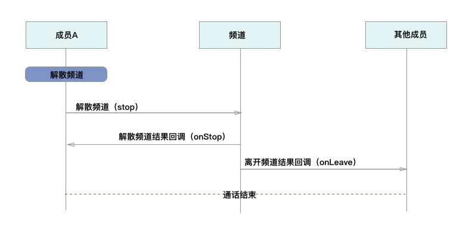

Android
===========================

.. _多方通话-Android:

.. highlight:: java

业务集成
----------------------------------

准备工作
>>>>>>>>>>>>>>>>>>>>>>>>>>>>>>>>>

开始之前，请您先做好如下准备工作：

- `Android SDK 下载 <http://developer.juphoon.com/document/cloud-communication-android-sdk#2>`_

- :ref:`Android SDK 配置和初始化<Android SDK 配置和初始化>` **您在 AndroidManifest 中进行权限配置时，请确保您能够获得打开摄像头、音视频录制等相关权限**

- :ref:`Android 登录<Android 登录>`

如果您已经做好相关准备工作，即可继续以下的内容。

业务集成
>>>>>>>>>>>>>>>>>>>>>>>>>>>>>>>>>

**相关类说明**

多方通话涉及以下类：

.. list-table::
   :header-rows: 1

   * - 名称
     - 描述
   * - JCMediaChannel
     - 媒体频道模块，类似音视频房间的概念，可以通过频道号加入此频道，从而进行音视频通话
   * - JCMediaChannelParticipant
     - 媒体频道成员
   * - JCMediaChannelCallback
     - 回调接口
   * - JCMediaDevice
     - 设备模块
   * - JCMediaDeviceVideoCanvas
     - 视频对象
   * - JCMediaChannelQueryInfo
     - 媒体频道查询信息结果

关于类的详细信息请参考 `API 说明文档 <http://developer.juphoon.com/portal/reference/android/>`_ 。

**开始集成多方通话功能前，请先进行** ``模块的初始化``
::

    // 初始化各模块，因为这些模块实例将被频繁使用，建议声明在单例中
    JCClient client = JCClient.create(Context, "your appkey", this, null);
    JCMediaDevice mediaDevice = JCMediaDevice.create(client, this);
    JCMediaChannel mediaChannel = JCMediaChannel.create(client, mediaDevice, this);

其中，创建 JCMediaChannel 实例的方法如下
::
    
    /**
     * 创建 JCMediaChannel 对象
     *
     * @param client      JCClient 对象
     * @param mediaDevice JCMediaDevice 对象
     * @param callback    JCMediaChannelCallback 回调接口，用于接收 JCMediaChannel 相关通知
     * @return            返回 JCMediaChannel 对象
     */
    public static JCMediaChannel create(JCClient client, JCMediaDevice mediaDevice, JCMediaChannelCallback callback);

**开始集成**

**1. 加入频道**

**场景一 ：语音通话**

.. image:: multiaudiocall.png

- 频道设置

加入频道之前可以调用下面的接口进行频道最大人数的设置
::

    /**
     * 设置相关配置参数
     *
     * @param key   配置关键字
     * @param value 参数值
     * @return      返回 true 表示设置成功，false 表示设置失败
     * @see ConfigKey
     */
    public abstract boolean setConfig(@ConfigKey String key, String value);

其中，参数 key 请参考 :ref:`配置参数<配置参数(android)>`。

- 发送本地音频流

在加入频道时，SDK 会 **自动打开音频设备**，因此可以在加入频道之前直接调用 enableUploadAudioStream 方法打开或关闭“上传音频”的标识，这样加入频道后其他成员就可以听到您的声音
::

    /**
     * 开启关闭发送本地音频流
     * 1.在频道中将会与服务器进行交互，服务器会更新状态并同步给其他用户
     * 2.未在频道中则标记是否上传音频流，在join时生效
     * 3.建议每次join前设置
     *
     * @param enable  是否开启本地音频流
     * @return        返回 true 表示正常执行调用流程，false 表示调用异常
     */
    public abstract boolean enableUploadAudioStream(boolean enable);

.. note:: 

        在多方通话中，enableUploadAudioStream 的作用是设置“是否发送音频流数据”，此方法可以在加入频道前调用，也可以在加入频道后调用。
         - 如果在加入频道前调用，**只是打开或关闭“上传音频”的标识，但不会发送数据**，当加入频道成功时服务器会根据 enableUploadAudioStream 设定的值来确定是否上传音频数据。同时，频道中的其他成员会收到该成员“是否上传音频“的状态变化回调（onParticipantUpdate）。
         - 如果在加入频道后调用，则会开启或者关闭发送本地音频流数据，服务器也会根据 enableUploadAudioStream 设定的值来确定是否上传音频数据。同时，频道中的其他成员会收到该成员“是否上传音频“的状态变化回调（onParticipantUpdate）。
        此外，此方法还可以实现开启或关闭静音的功能。当 enable 值为 false ，将会停止发送本地音频流，此时其他成员将听不到您的声音，从而实现静音功能。

要实现语音通话，需要通过下面的接口将发送本地视频流(enableUploadVideoStream)设置为 false 
::

    /**
     * 开启关闭发送本地视频流
     * 1.在会议中将会与服务器进行交互，服务器会更新状态并同步给其他用户
     * 2.未在频道中则标记是否上传视频流，在join时生效
     * 3.建议每次join前设置
     *
     * @param enable  是否开启本地视频流
     * @return        返回 true 表示正常执行调用流程，false 表示调用异常
     */
    public abstract boolean enableUploadVideoStream(boolean enable);

.. note:: 

    在多方通话中，enableUploadVideoStream 的作用是设置“是否上传视频流数据”，可以在加入频道前调用，也可以在加入频道后调用；
     - 如果在加入频道前调用，**只是打开或关闭“上传视频流”的标识，但不发送数据**，当加入频道后会根据 enableUploadVideoStream 设定的值来确定是否上传视频流数据。同时，频道中的其他成员会收到该成员”是否上传视频“的状态变化回调（onParticipantUpdate）。如果设定的值为 false，则在加入频道后自动开启语音通话模式。
     - 如果在加入频道后调用，则会开启或关闭发送本地视频流数据。服务器会根据 enableUploadVideoStream 设定的值来确定是否上传视频流数据。同时，频道中的其他成员会收到该成员”是否上传视频“的状态变化回调（onParticipantUpdate），从而进行语音通话和视频通话的切换。
    此外，调用该方法发送本地视频流数据还要依赖摄像头是否已经打开。

- 加入频道
::

    /**
     * 加入频道
     *
     * @param channelIdOrUri  媒体频道标识或者频道Uri，当 params 中 JOIN_PARAM_URI_MODE 设置为 true 时表示频道 Uri，其他表示频道标识
     * @param params          参数，KEY值参考JoinParam，没有则填null
     * @return                返回 true 表示正常执行调用流程，false 表示调用异常
     * @see MaxResolution
     * @see JoinParam
     */
    public abstract boolean join(String channelIdOrUri, Map<String, String> params);

其中，params 参数列表如下：

.. list-table::
   :header-rows: 1

   * - 名称
     - 描述
   * - JOIN_PARAM_CDN = "cdn"
     - CDN 地址参数
   * - JOIN_PARAM_RECORD = "record"
     - 音视频录制参数，包括"BucketName", "SecretKey","AccessKey"和"FileKey",参数值通过在七牛云注册获得
   * - JOIN_PARAM_PASSWORD = "password"
     - 密码
   * - JOIN_PARAM_MAX_RESOLUTION = "maxResolution"
     - 最大分辨率，支持 360p、720p、1080p
   * - JOIN_SMOOTH_MODE= "smoothMode"
     - 平滑模式，确保弱网环境下视频流畅

.. note:: 加入频道会自动打开音频设备。

**示例代码**

::

    // 设置频道人数
    mediaChannel.setConfig(JCMediaChannel.CONFIG_CAPACITY, "6");
    // 发送本地音频流
    mediaChannel.enableUploadAudioStream(true);
    // 停止发送本地视频流
    mediaChannel.enableUploadVideoStream(false);
    // 加入频道
    mediaChannel.join("channelId", null);

加入频道结果回调
::

    /**
     * 加入频道结果回调
     *
     * @param result    true 表示成功，false 表示失败
     * @param reason    加入失败原因，当 result 为 false 时该值有效
     * @param channelId 频道标识符
     */
    void onJoin(boolean result, @JCMediaChannel.MediaChannelReason int reason, String channelId);

示例代码::

    // 加入频道结果回调
    public void onJoin(boolean result, @JCMediaChannel.MediaChannelReason int reason, String channelId) {
        if (result) {
            // 加入频道成功
        } else {
            // 加入频道失败
        }
    }

现在您可以开始多方语音通话了。

^^^^^^^^^^^^^^^^^^^^^^^^^^^^^^^^^^^^

**场景二 ：视频通话**

.. image:: multivideocall.png

- 频道设置

加入频道之前可以调用下面的接口进行频道最大人数的设置
::

    /**
     * 设置相关配置参数
     *
     * @param key   配置关键字
     * @param value 参数值
     * @return      返回 true 表示设置成功，false 表示设置失败
     * @see ConfigKey
     */
    public abstract boolean setConfig(@ConfigKey String key, String value);

其中，参数 key 请参考 :ref:`配置参数<配置参数(android)>`。

- 发送本地音频流

在加入频道时，SDK 会 **自动打开音频设备**，因此可以在加入频道之前直接调用 enableUploadAudioStream 方法打开或关闭“上传音频”的标识，这样加入频道后其他成员就可以听到您的声音
::

    /**
     * 开启关闭发送本地音频流
     * 1.在频道中将会与服务器进行交互，服务器会更新状态并同步给其他用户
     * 2.未在频道中则标记是否上传音频流，在join时生效
     * 3.建议每次join前设置
     *
     * @param enable 是否开启本地音频流
     * @return 返回 true 表示正常执行调用流程，false 表示调用异常
     */
    public abstract boolean enableUploadAudioStream(boolean enable);

.. note:: 

        在多方通话中，enableUploadAudioStream 的作用是设置“是否发送音频流数据”，此方法可以在加入频道前调用，也可以在加入频道后调用。
         - 如果在加入频道前调用，**只是打开或关闭“上传音频”的标识，但不会发送数据**，当加入频道成功时会根据 enableUploadAudioStream 设定的值来确定是否上传音频数据。同时，频道中的其他成员会收到该成员“是否上传音频“的状态变化回调（onParticipantUpdate）。
         - 如果在加入频道后调用，则会开启或者关闭发送本地音频流数据，服务器也会根据 enableUploadAudioStream 设定的值来确定是否上传音频数据。同时，频道中的其他成员会收到该成员“是否上传音频“的状态变化回调（onParticipantUpdate）。
        此外，此方法还可以实现开启或关闭静音的功能。当 enable 值为 false ，将会停止发送本地音频流，此时其他成员将听不到您的声音，从而实现静音功能

- 发送本地视频流

在加入频道前可以调用下面的方法打开或关闭“上传视频流”的标识，如果想看到视图画面，需要在加入频道后手动调用打开摄像头的接口
::

    /**
     * 开启关闭发送本地视频流
     * 1.在会议中将会与服务器进行交互，服务器会更新状态并同步给其他用户
     * 2.未在频道中则标记是否上传视频流，在join时生效
     * 3.建议每次join前设置
     *
     * @param enable 是否开启本地视频流
     * @return 返回 true 表示正常执行调用流程，false 表示调用异常
     */
    public abstract boolean enableUploadVideoStream(boolean enable);

.. note:: 

    在多方通话中，enableUploadVideoStream 的作用是设置“是否上传视频流数据”，可以在加入频道前调用，也可以在加入频道后调用；
     - 如果在加入频道前调用，**只是打开或关闭“上传视频流”的标识，但不发送数据**，当加入频道后会根据 enableUploadVideoStream 设定的值来确定是否上传视频流数据。同时，频道中的其他成员会收到该成员”是否上传视频“的状态变化回调（onParticipantUpdate）。如果设定的值为 false，则在加入频道后自动开启语音通话模式。
     - 如果在加入频道后调用，则会开启或关闭发送本地视频流数据。服务器会根据 enableUploadVideoStream 设定的值来确定是否上传视频流数据。同时，频道中的其他成员会收到该成员”是否上传视频“的状态变化回调（onParticipantUpdate），从而进行语音通话和视频通话的切换。
    此外，调用该方法发送本地视频流数据还要依赖摄像头是否已经打开。

- 加入频道
::

    /**
     * 加入频道
     *
     * @param channelIdOrUri  媒体频道标识或者频道Uri，当 params 中 JOIN_PARAM_URI_MODE 设置为 true 时表示频道 Uri，其他表示频道标识
     * @param params          参数，KEY值参考JoinParam，没有则填null
     * @return                返回 true 表示正常执行调用流程，false 表示调用异常
     * @see MaxResolution
     * @see JoinParam
     */
    public abstract boolean join(String channelIdOrUri, Map<String, String> params);

其中，params 参数列表如下：

.. list-table::
   :header-rows: 1

   * - 名称
     - 描述
   * - JOIN_PARAM_CDN = "cdn"
     - CDN 地址参数
   * - JOIN_PARAM_RECORD = "record"
     - 音视频录制参数，包括"BucketName", "SecretKey","AccessKey"和"FileKey",参数值通过在七牛云注册获得
   * - JOIN_PARAM_PASSWORD = "password"
     - 密码
   * - JOIN_PARAM_MAX_RESOLUTION = "maxResolution"
     - 最大分辨率，支持 360p、720p、1080p
   * - JOIN_SMOOTH_MODE= "smoothMode"
     - 平滑模式，确保弱网环境下视频流畅

.. note:: 加入频道会自动打开音频设备。

**示例代码**

::

    // 设置频道人数
    mediaChannel.setConfig(JCMediaChannel.CONFIG_CAPACITY, "6");
    // 发送本地音频流
    mediaChannel.enableUploadAudioStream(true);
    // 发送本地视频流
    mediaChannel.enableUploadVideoStream(true);
    // 加入频道
    mediaChannel.join("channelId", null);

加入频道结果回调
::

    /**
     * 加入频道结果回调
     *
     * @param result    true 表示成功，false 表示失败
     * @param reason    加入失败原因，当 result 为 false 时该值有效
     * @param channelId 频道标识符
     */
    void onJoin(boolean result, @JCMediaChannel.MediaChannelReason int reason, String channelId);

示例代码::

    // 加入频道结果回调
    public void onJoin(boolean result, @JCMediaChannel.MediaChannelReason int reason, String channelId) {
        if (result) {
            // 加入频道成功
        } else {
            // 加入频道失败
        }
    }

- :ref:`创建本地视图画面<创建本地视图画面(android)>`

加入频道后，如果想看到本地视图画面，需要打开摄像头以创建视图画面。

创建视图画面需要用到 :ref:`JCMediaDevice<JCMediaDevice(android)>` 类和 :ref:`JCMediaDeviceVideoCanvas<JCMediaDeviceVideoCanvas(android)>` 类。

本地视图渲染调用 :ref:`startCameraVideo<创建本地视图画面(android)>` 接口，**该接口会打开摄像头**

::

    /**
     * 获得视频预览对象，通过此对象能获得视图用于UI显示
     *
     * @param renderType    渲染模式
     * @return              JCMediaDeviceVideoCanvas 对象
     * @see RenderType
     */
    public abstract JCMediaDeviceVideoCanvas startCameraVideo(@RenderType int renderType);

其中，渲染模式（JCMediaDeviceRender)请参考 :ref:`渲染模式<渲染模式(android)>`。

示例代码::

    // 创建本地视频画面对象
    JCMediaDeviceVideoCanvas localCanvas = mediaDevice.startCameraVideo(JCMediaDevice.RENDER_FULL_CONTENT);
    viewGroup.addView(localCanvas.getVideoView(), 0);

- :ref:`创建远端视图画面<创建远端视图画面(android)>`

当新成员加入频道后，其他成员会收到成员加入的回调
::

    /**
     * 新成员加入回调
     *
     * @param participant 成员对象
     */
    void onParticipantJoin(JCMediaChannelParticipant participant);

此时可以进行远端视图渲染并请求远端成员的视频流。

远端视频渲染

远端视频渲染调用 :ref:`startVideo<创建远端视图画面(android)>` 接口获取视频对象
::

    /**
     * 获得视频对象，通过此对象能获得视图用于UI显示
     *
     * @param videoSource   渲染标识串，比如 JCMediaChannelParticipant JCCallItem 中的 renderId
     * @param renderType    渲染模式
     * @return              JCMediaDeviceVideoCanvas 对象
     * @see RenderType
     */
    public abstract JCMediaDeviceVideoCanvas startVideo(String videoSource, @RenderType int renderType);

- 请求远端成员视频流

由于服务器默认是不转发视频数据的，所以如果想看到远端成员画面需要请求远端成员的视频流
::
   
    /**
     * 请求频道中其他用户的视频流
     * 当 pictureSize 为 JCMediaChannelPictureSizeNone 时表示关闭请求
     *
     * @param participant   频道中其他成员对象
     * @param pictureSize   视频请求的尺寸类型
     * @return              返回 true 表示正常执行调用流程，false 表示调用异常
     * @see JCMediaChannel.PictureSize
     */
    public abstract boolean requestVideo(JCMediaChannelParticipant participant, @PictureSize int pictureSize);

其中，视频尺寸（JCMediaChannelPictureSize）有以下几种：

.. list-table::
   :header-rows: 1

   * - 名称
     - 描述
   * - public static final int PICTURESIZE_NONE = 0
     - 不请求
   * - public static final int PICTURESIZE_MIN = 1
     - 最小尺寸，160x90
   * - public static final int PICTURESIZE_SMALL = 2
     - 小尺寸，320x180，小窗口模式下可以使用小尺寸
   * - public static final int PICTURESIZE_LARGE = 3
     - 大尺寸，640x360
   * - public static final int PICTURESIZE_MAX = 4
     - 最大尺寸，360P 的会议为 640x360 ，720P 的会议为 1280x720

.. note:: 您可以根据相应的窗口大小使用相应的视频尺寸，比如窗口的大小是 160x90，则应该使用 JCMediaChannelPictureSizeMin，避免造成不必要的流量浪费和额外的功耗。

现在您可以开始多方视频通话了。

**示例代码**

::

    public void onParticipantJoin(JCMediaChannelParticipant participant) {
        // 创建远端视频画面对象，renderId来源JCMediaChannelParticipant对象
        List<JCMediaChannelParticipant> partps = mediaChannel.getParticipants();
        JCMediaChannelParticipant item = partps.get(0);
        String renderId = item.getRenderId();
        JCMediaDeviceVideoCanvas remoteCanvas = mediaDevice.startVideo(renderId, JCMediaDevice.RENDER_FULL_CONTENT);
        viewGroup.addView(remoteCanvas.getVideoView(), 0);
        // 请求远端视频流，participant为JCMediaChannelParticipant对象
        mediaChannel.requestVideo(participant, JCMediaChannel.PICTURESIZE_LARGE);
    }

^^^^^^^^^^^^^^^^^^^^^^^^^^^^^^^^^^^^^^^^^^

**2. 离开频道**

.. image:: leavechannel.png

如果想离开频道，可以调用下面的接口
::

    /**
     * 离开频道
     *
     * @return 返回 true 表示正常执行调用流程，false 表示调用异常
     */
    public abstract boolean leave();

示例代码::

    // 离开频道
    mediaChannel.leave();

离开频道后，UI 监听回调离开的原因
::

    /**
     * 离开频道结果回调
     *
     * @param reason    离开原因
     * @param channelId 频道标识符
     */
    void onLeave(@JCMediaChannel.MediaChannelReason int reason, String channelId);

离开原因枚举值请参考 `JCMediaChannelReason <http://developer.juphoon.com/portal/reference/android/>`_。

示例代码::

    // 离开频道结果回调
    public void onLeave(@JCMediaChannel.MediaChannelReason int reason, String channelId) {
        // 频道号 channelId ，原因 reason
    }

如果是多方视频通话，则在离开频道后还需要调用 :ref:`stopVideo<销毁本地和远端视图画面(android)>` 接口移除视频画面
::

    /**
     * 停止视频
     *
     * @param canvas JCMediaDeviceVideoCanvas 对象，由 startVideo 获得
     */
    public abstract void stopVideo(JCMediaDeviceVideoCanvas canvas);

**解散频道**

如果想解散频道，可以调用下面的接口，此时所有成员都将被退出
::

    /**
     * 关闭频道，所有成员都将被退出
     *
     * @return 返回 true 表示正常执行调用流程，false 表示调用异常
     */
    public abstract boolean stop();

示例代码::

    // 结束频道
    mediaChannel.stop();

关闭频道的结果通过 onStop 回调
::

    /**
     * 解散频道结果回调
     *
     * @param result    true 表示成功，false 表示失败
     * @param reason    解散失败原因，当 result 为 false 时该值有效
     */
    void onStop(boolean result, @JCMediaChannel.MediaChannelReason int reason);

**更多功能**

- :ref:`视频采集和渲染<视频采集和渲染(android)>`

- :ref:`设备控制<设备控制(android)>`

- :ref:`通话状态更新<通话状态更新(android)>`

- :ref:`通话过程控制<通话过程控制(android)>`

**进阶**

在实现音视频通话的过程中，您可能还需要添加以下功能来增强您的应用：

- :ref:`查询频道<查询频道(android)>`
- :ref:`屏幕共享<屏幕共享(android)>`
- :ref:`CDN 推流<CDN 推流(android)>`
- :ref:`音视频录制<音视频录制(android)>`
- :ref:`发送消息<发送消息(android)>`
- :ref:`发送指令<发送指令(android)>`

