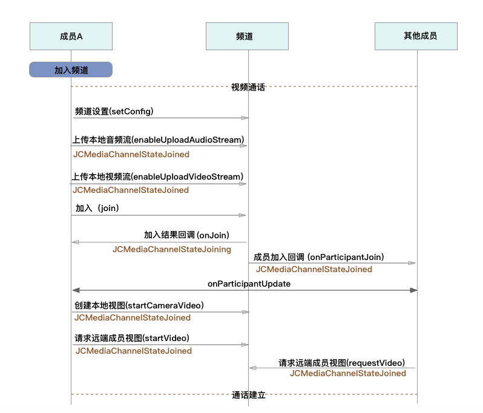

iOS
===============================

业务集成
----------------------------------

准备工作
>>>>>>>>>>>>>>>>>>>>>>>>>>>>>>>>

开始之前，请您先做好如下准备工作：

- `iOS SDK 下载 <http://developer.juphoon.com/document/cloud-communication-ios-sdk#2>`_

- :ref:`iOS SDK 配置和初始化<iOS SDK 配置和初始化>`

- :ref:`iOS 登录<iOS 登录>`

如果您已经做好相关准备工作，即可继续以下的内容。

业务集成
>>>>>>>>>>>>>>>>>>>>>>>>>>>>>>>>>>>>>>>>>>>>>>

.. highlight:: objective-c

**相关类说明**

多方通话涉及以下类：

.. list-table::
   :header-rows: 1

   * - 名称
     - 描述
   * - JCMediaChannel
     - 媒体频道模块，类似音视频房间的概念，可以通过频道号加入此频道，从而进行音视频通话
   * - JCMediaChannelParticipant
     - 媒体频道成员
   * - JCMediaChannelCallback
     - 回调接口
   * - JCMediaDevice
     - 设备模块
   * - JCMediaDeviceVideoCanvas
     - 视频对象
   * - JCMediaChannelQueryInfo
     - 媒体频道查询信息结果

关于类的详细信息请参考 `API 说明文档 <http://developer.juphoon.com/portal/reference/ios/>`_ 。

**开始集成多方通话功能前，请先进行** ``模块的初始化``
::

    // 初始化各模块，因为这些模块实例将被频繁使用，建议声明在单例中
    JCClient *client = [JCClient create:@"your appkey" callback:self extraParams:nil];
    JCMediaDevice *mediaDevice = [JCMediaDevice create:client callback:self];
    JCMediaChannel *mediaChannel = [JCMediaChannel create:client mediaDevice:mediaDevice callback:self];

其中，创建 JCMediaChannel 实例的方法如下
::

    /**
     *  @brief     创建 JCMediaChannel 对象
     *  @param     client JCClient 对象
     *  @param     mediaDevice JCMediaDevice 对象
     *  @param     callback JCMediaChannelCallback 回调接口，用于接收 JCMediaChannel 相关通知
     *  @return    返回 JCMediaChannel 对象
     */
    +(JCMediaChannel*)create:(JCClient*)client mediaDevice:(JCMediaDevice*)mediaDevice callback:(id<JCMediaChannelCallback>)callback;

**开始集成**

**1. 加入频道**

**场景一 ：语音通话**

.. image:: multiaudiocall.png

- 频道设置

加入频道之前可以调用下面的接口进行频道最大人数的设置
::

    /**
     *  @brief              设置配置相关参数
     *  @param key          参数关键字
     *  @param value        参数值
     *  @return             返回 true 表示设置成功，false 表示设置失败
     */
    -(bool)setConfig:(NSString*)key value:(NSString*)value;

其中，参数 key 请参考 :ref:`配置参数<配置参数(ios)>`。

- 发送本地音频流

在加入频道时，SDK 会 **自动打开音频设备**，因此可以在加入频道之前直接调用 enableUploadAudioStream 方法打开或关闭“上传音频”的标识，这样加入频道后其他成员就可以听到您的声音
::

    /**
     *  @brief 开启关闭发送本地音频流
     *      1.在频道中将会与服务器进行交互，服务器会更新状态并同步给其他用户
     *      2.未在频道中则标记是否上传音频流，在join时生效
     *      3.建议每次join前设置
     *  @param enable    是否开启本地音频流
     *  @return          返回 true 表示正常执行调用流程，false 表示调用异常
     */
     -(bool)enableUploadAudioStream:(bool)enable;

.. note:: 

        在多方通话中，enableUploadAudioStream 的作用是设置“是否发送音频流数据”，此方法可以在加入频道前调用，也可以在加入频道后调用。
         - 如果在加入频道前调用，**只是打开或关闭“上传音频”的标识，但不会发送数据**，当加入频道成功时会根据 enableUploadAudioStream 设定的值来确定是否上传音频数据。同时，频道中的其他成员会收到该成员“是否上传音频“的状态变化回调（onParticipantUpdate）。
         - 如果在加入频道后调用，则会开启或者关闭发送本地音频流数据，服务器也会根据 enableUploadAudioStream 设定的值来确定是否上传音频数据。同时，频道中的其他成员会收到该成员“是否上传音频“的状态变化回调（onParticipantUpdate）。
        此外，此方法还可以实现开启或关闭静音的功能。当 enable 值为 false ，将会停止发送本地音频流，此时其他成员将听不到您的声音，从而实现静音功能。

要实现语音通话，需要通过下面的接口将发送本地视频流(enableUploadVideoStream)设置为 false 
::

    /**
     *  @brief 开启关闭发送本地视频流
     *      1.在频道中将会与服务器进行交互，服务器会更新状态并同步给其他用户
     *      2.未在频道中则标记是否上传音频流，在join时生效
     *      3.建议每次join前设置
     *  @param enable    是否开启本地视频流
     *  @return          返回 true 表示正常执行调用流程，false 表示调用异常
     */
    -(bool)enableUploadVideoStream:(bool)enable;

.. note:: 

    在多方通话中，enableUploadVideoStream 的作用是设置“是否上传视频流数据”，可以在加入频道前调用，也可以在加入频道后调用；
     - 如果在加入频道前调用，**只是打开或关闭“上传视频流”的标识，但不发送数据**，当加入频道后会根据 enableUploadVideoStream 设定的值来确定是否上传视频流数据。同时，频道中的其他成员会收到该成员”是否上传视频“的状态变化回调（onParticipantUpdate）。如果设定的值为 false，则在加入频道后自动开启语音通话模式。
     - 如果在加入频道后调用，则会开启或关闭发送本地视频流数据。服务器会根据 enableUploadVideoStream 设定的值来确定是否上传视频流数据。同时，频道中的其他成员会收到该成员”是否上传视频“的状态变化回调（onParticipantUpdate），从而进行语音通话和视频通话的切换。
    此外，调用该方法发送本地视频流数据还要依赖摄像头是否已经打开。

- 加入频道

::

    /**
     * 加入频道
     *  @param channelIdOrUri    媒体频道标识或者频道Uri，当 params 中 JCMediaChannelJoinParamUriMode 设置为 true 时表示频道 Uri，其他表示频道标识
     *  @param params            Key值参考 JCMediaChannelJoinParamRecord、JCMediaChannelJoinParamCdn、JCMediaChannelJoinParamPassword、JCMediaChannelJoinParamMaxResolution, 没有则为nil
     *  @return                  返回 true 表示正常执行调用流程，false 表示调用异常
     */
    -(bool)join:(NSString*)channelIdOrUri params:(NSMutableDictionary *)params;

其中，params 参数列表如下：

.. list-table::
   :header-rows: 1

   * - 名称
     - 描述
   * - JCMediaChannelConfigCdn
     - CDN 地址参数
   * - JCMediaChannelConfigRecord
     - 音视频录制参数，包括"BucketName", "SecretKey","AccessKey"和"FileKey",参数值通过在七牛云注册获得
   * - JCMediaChannelConfigPassword
     - 密码
   * - JCMediaChannelConfigMax
     - 最大分辨率，支持 360p、720p、1080p
   * - JCMediaChannelConfigSmoothMode
     - 设置平滑模式，确保弱网环境下视频流畅

.. note:: 加入频道会自动打开音频设备。

**示例代码**

::

    // 设置频道人数
    [mediaChannel setConfig:JCMediaChannelConfigCapacity value:@"6"];
    // 停止发送本地视频流
    [mediaChannel enableUploadVideoStream:false];
    // 发送本地音频流
    [mediaChannel enableUploadAudioStream:true];
    // 加入频道
    [mediaChannel join:@"channelId" params:nil];

加入频道结果回调
::

    /**
     *  @brief             加入频道结果回调
     *  @param result      true 表示成功，false 表示失败
     *  @param reason      加入失败原因，当 result 为 false 时该值有效
     *  @param channelId   媒体频道标识符
     *  @see JCMediaChannelReason
     */
    -(void)onJoin:(bool)result reason:(JCMediaChannelReason)reason channelId:(NSString*)channelId;

示例代码::

    // 加入频道结果回调
    -(void)onJoin:(bool)result reason:(JCMediaChannelReason)reason channelId:(NSString*)channelId
    {
        if (result) {
          // 加入成功
        } else {
          // 加入失败
        }
    }

现在您可以开始多方语音通话了。

^^^^^^^^^^^^^^^^^^^^^^^^^^^^^^^^^^^^

**场景二 ：视频通话**

- 频道设置

加入频道之前可以调用下面的接口进行频道最大人数的设置
::

    /**
     *  @brief              设置配置相关参数
     *  @param key          参数关键字
     *  @param value        参数值
     *  @return             返回 true 表示设置成功，false 表示设置失败
     */
    -(bool)setConfig:(NSString*)key value:(NSString*)value;

其中，参数 key 请参考 :ref:`配置参数<配置参数(ios)>`。

- 发送本地音频流

在加入频道时，SDK 会 **自动打开音频设备**，因此可以在加入频道之前直接调用 enableUploadAudioStream 方法打开或关闭“上传音频”的标识，这样加入频道后其他成员就可以听到您的声音
::

    /**
     *  @brief 开启关闭发送本地音频流
     *      1.在频道中将会与服务器进行交互，服务器会更新状态并同步给其他用户
     *      2.未在频道中则标记是否上传音频流，在join时生效
     *      3.建议每次join前设置
     *  @param enable 是否开启本地音频流
     *  @return 返回 true 表示正常执行调用流程，false 表示调用异常
     */
    -(bool)enableUploadAudioStream:(bool)enable;

.. note:: 

        在多方通话中，enableUploadAudioStream 的作用是设置“是否发送音频流数据”，此方法可以在加入频道前调用，也可以在加入频道后调用。
         - 如果在加入频道前调用，**只是打开或关闭“上传音频”的标识，但不会发送数据**，当加入频道成功时会根据 enableUploadAudioStream 设定的值来确定是否上传音频数据。同时，频道中的其他成员会收到该成员“是否上传音频“的状态变化回调（onParticipantUpdate）。
         - 如果在加入频道后调用，则会开启或者关闭发送本地音频流数据，服务器也会根据 enableUploadAudioStream 设定的值来确定是否上传音频数据。同时，频道中的其他成员会收到该成员“是否上传音频“的状态变化回调（onParticipantUpdate）。
        此外，此方法还可以实现开启或关闭静音的功能。当 enable 值为 false ，将会停止发送本地音频流，此时其他成员将听不到您的声音，从而实现静音功能。

- 发送本地视频流

在加入频道前可以调用下面的方法打开或关闭”上传视频流“的标识，如果想看到视图画面，需要在加入频道后手动调用打开摄像头的接口
::

    /**
     *  @brief 开启关闭发送本地视频流
     *      1.在频道中将会与服务器进行交互，服务器会更新状态并同步给其他用户
     *      2.未在频道中则标记是否上传音频流，在join时生效
     *      3.建议每次join前设置
     *  @param enable    是否开启本地视频流
     *  @return          返回 true 表示正常执行调用流程，false 表示调用异常
     */
    -(bool)enableUploadVideoStream:(bool)enable;

.. note:: 

    在多方通话中，enableUploadVideoStream 的作用是设置“是否上传视频流数据”，可以在加入频道前调用，也可以在加入频道后调用；
     - 如果在加入频道前调用，**只是打开或关闭“上传视频流”的标识，但不发送数据**，当加入频道后会根据 enableUploadVideoStream 设定的值来确定是否上传视频流数据。同时，频道中的其他成员会收到该成员”是否上传视频“的状态变化回调（onParticipantUpdate）。如果设定的值为 false，则在加入频道后自动开启语音通话模式。
     - 如果在加入频道后调用，则会开启或关闭发送本地视频流数据。服务器会根据 enableUploadVideoStream 设定的值来确定是否上传视频流数据。同时，频道中的其他成员会收到该成员”是否上传视频“的状态变化回调（onParticipantUpdate），从而进行语音通话和视频通话的切换。
    此外，调用该方法发送本地视频流数据还要依赖摄像头是否已经打开。

- 加入频道

::

    /**
     * 加入频道
     *  @param channelIdOrUri    媒体频道标识或者频道Uri，当 params 中 JCMediaChannelJoinParamUriMode 设置为 true 时表示频道 Uri，其他表示频道标识
     *  @param params            Key值参考 JCMediaChannelJoinParamRecord、JCMediaChannelJoinParamCdn、JCMediaChannelJoinParamPassword、JCMediaChannelJoinParamMaxResolution, 没有则为nil
     *  @return                  返回 true 表示正常执行调用流程，false 表示调用异常
     */
    -(bool)join:(NSString*)channelIdOrUri params:(NSMutableDictionary *)params;

其中，params 参数列表如下：

.. list-table::
   :header-rows: 1

   * - 名称
     - 描述
   * - JCMediaChannelConfigCdn
     - CDN 地址参数
   * - JCMediaChannelConfigRecord
     - 音视频录制参数，包括"BucketName", "SecretKey","AccessKey"和"FileKey",参数值通过在七牛云注册获得
   * - JCMediaChannelConfigPassword
     - 密码
   * - JCMediaChannelConfigMax
     - 最大分辨率，支持 360p、720p、1080p
   * - JCMediaChannelConfigSmoothMode
     - 设置平滑模式，确保弱网环境下视频流畅

.. note:: 加入频道会自动打开音频设备。

**示例代码**

::

    // 设置频道人数
    [mediaChannel setConfig:JCMediaChannelConfigCapacity value:@"6"];
    // 发送本地视频流
    [mediaChannel enableUploadVideoStream:true];
    // 发送本地音频流
    [mediaChannel enableUploadAudioStream:true];
    // 加入频道
    [mediaChannel join:@"channelId" params:nil];

加入频道结果回调
::

    /**
     *  @brief             加入频道结果回调
     *  @param result      true 表示成功，false 表示失败
     *  @param reason      加入失败原因，当 result 为 false 时该值有效
     *  @param channelId   媒体频道标识符
     *  @see JCMediaChannelReason
     */
    -(void)onJoin:(bool)result reason:(JCMediaChannelReason)reason channelId:(NSString*)channelId;

示例代码::

    // 加入频道结果回调
    -(void)onJoin:(bool)result reason:(JCMediaChannelReason)reason channelId:(NSString*)channelId
    {
        if (result) {
          // 加入成功
        } else {
          // 加入失败
        }
    }

- :ref:`创建本地视图画面<创建本地视图画面>`

加入频道后，如果想看到本地视图画面，需要打开摄像头以创建视图画面。

创建视图画面需要用到 :ref:`JCMediaDevice<JCMediaDevice>` 类和 :ref:`JCMediaDeviceVideoCanvas<JCMediaDeviceVideoCanvas>` 类。

本地视图渲染调用 JCMediaDevice 类中的 :ref:`startCameraVideo<创建本地视图画面>` 接口，**该接口会打开摄像头**
::

    /**
     *  @brief 获得预览视频对象，通过此对象能获得视图用于UI显示
     *  @param type 渲染模式，@ref JCMediaDeviceRender
     *  @return JCMediaDeviceVideoCanvas 对象
     */
    -(JCMediaDeviceVideoCanvas*)startCameraVideo:(int)type;

示例代码::

    // 创建本地视频画面对象
    JCMediaDeviceVideoCanvas *local = [mediaDevice startCameraVideo:JCMediaDeviceRenderFullContent];
    local.videoView.frame = CGRectMake(0, 0, 100, 100);
    [self.view addSubview:local.videoView];

- :ref:`创建远端视图画面<创建远端视图画面>`

当新成员加入频道后，其他成员会收到成员加入的回调
::

    /**
     *  @brief              新成员加入回调
     *  @param participant  成员对象
     */
    -(void)onParticipantJoin:(JCMediaChannelParticipant*)participant;

此时可以进行远端视图渲染并请求远端成员的视频流。

远端视频渲染

远端视图渲染调用 :ref:`startVideo<创建远端视图画面>` 接口获得预览视频对象
::

    /**
     *  @brief                  获得预览视频对象，通过此对象能获得视图用于UI显示
     *  @param videoSource      渲染标识串，比如 JCMediaChannelParticipant JCCallItem 中的 renderId
     *  @param type             渲染模式，@ref JCMediaDeviceRender
     *  @return JCMediaDeviceVideoCanvas 对象
     */
    -(JCMediaDeviceVideoCanvas*)startVideo:(NSString*)videoSource renderType:(int)type;

其中，渲染模式（JCMediaDeviceRender)请参考 :ref:`渲染模式<渲染模式>`。

- 请求远端成员视频流

由于服务器默认是不转发视频数据的，所以如果想看到远端成员画面需要调用 requestVideo 接口请求远端成员的视频流
::
   
    /**
     *  @brief                 请求频道中其他用户的视频流
     *  @param participant     频道中其他成员对象
     *  @param pictureSize     视频请求尺寸类型
     *  @return                返回 true 表示正常执行调用流程，false 表示调用异常
     *  @see JCMediaChannelPictureSize
     *  @warning 当 pictureSize 为 JCMediaChannelPictureSizeNone 表示关闭请求
     */
    -(bool)requestVideo:(JCMediaChannelParticipant*)participant pictureSize:(JCMediaChannelPictureSize)pictureSize;

其中，视频尺寸（JCMediaChannelPictureSize）有以下几种：

.. list-table::
   :header-rows: 1

   * - 名称
     - 描述
   * - JCMediaChannelPictureSizeNone
     - 不请求
   * - JCMediaChannelPictureSizeMin
     - 最小尺寸，160x90
   * - JCMediaChannelPictureSizeSmall
     - 小尺寸，320x180，小窗口模式下可以使用小尺寸
   * - JCMediaChannelPictureSizeLarge
     - 大尺寸，640x360
   * - JCMediaChannelPictureSizeMax
     - 最大尺寸，360P 的会议为 640x360 ，720P 的会议为 1280x720

.. note:: 您可以根据相应的窗口大小使用相应的视频尺寸，比如窗口的大小是 160x90，则应该使用 JCMediaChannelPictureSizeMin，避免造成不必要的流量浪费和额外的功耗。

现在您可以开始多方视频通话了。

示例代码::

    -(void)onParticipantJoin:(JCMediaChannelParticipant*)participant {
        // 创建远端视频画面对象，renderId来源JCMediaChannelParticipant对象
        NSArray *partps = mediaChannel.participants
        for (JCMediaChannelParticipant * partp in partps) {
             // 如果是本端
            if ([partp.userId isEqualToString:client.userId]) {
                // 本地视频渲染
                ...
            } else {
                // 远端视频渲染
                JCMediaDeviceVideoCanvas *remote = [mediaDevice startVideo:partp.renderId renderType:JCMediaDeviceRenderFullContent];
                // 请求远端视频流
                [mediaChannel requestVideo:partp pictureSize:JCMediaChannelPictureSizeMin];
                remote.videoView.frame = CGRectMake(100, 0, 100, 100);
                [self.view addSubview:remote.videoView];
            }
        }
    }

^^^^^^^^^^^^^^^^^^^^^^^^^^^^^^^^^^^^^^^^^^

**2. 离开频道**

.. image:: leavechannel.png

如果想离开频道，可以调用下面的接口
::

    /**
     *  离开媒体频道
     *  @return  返回 true 表示正常执行调用流程，false 表示调用异常
     */
    -(bool)leave;

示例代码::

    // 离开频道
    [mediaChannel leave];

离开频道后，UI 监听回调离开的原因
::

    /**
     *  @brief             离开频道结果回调
     *  @param reason      离开原因
     *  @param channelId   频道标识符
     *  @see JCMediaChannelReason
     */
    -(void)onLeave:(JCMediaChannelReason)reason channelId:(NSString*)channelId;

离开原因枚举值请参考 `JCMediaChannelReason <http://developer.juphoon.com/portal/reference/ios/Constants/JCMediaChannelReason.html>`_。

示例代码::

    // 离开频道回调
    -(void)onLeave:(JCMediaChannelReason)reason channelId:(NSString*)channelId;
    {
       // 离开频道
    }

如果是多方视频通话，还需要在离开频道后调用 :ref:`stopVideo<销毁本地和远端视图画面>` 接口移除视频画面
::

    /**
     *  @brief 停止视频
     *  @param canvas JCMediaDeviceVideoCanvas 对象，由 startVideo 获得
     */
    -(void)stopVideo:(JCMediaDeviceVideoCanvas*)canvas;

**解散频道**

.. image:: stopchannel.png

如果想解散频道，可以调用下面的接口，此时所有成员都将被退出
::

    /**
    *  @brief 关闭频道，所有成员都将被退出
    *  @return 返回 true 表示正常执行调用流程，false 表示调用异常
    */
    -(bool)stop;

示例代码::

    // 结束频道
    [mediaChannel stop];

关闭频道的结果通过 onStop 回调
::

    /**
     * brief 解散频道结果回调
     * @param result    true 表示成功，false 表示失败
     * @param reason    解散失败原因，当 result 为 false 时该值有效
     */
    -(void)onStop:(bool)result reason:(JCMediaChannelReason)reason;

**更多功能**

- :ref:`视频采集和渲染<视频采集和渲染(ios)>`

- :ref:`设备控制<设备控制(ios)>`

- :ref:`通话状态更新<通话状态更新(ios)>`

- :ref:`通话过程控制<通话过程控制(ios)>`

**进阶**

在实现音视频通话的过程中，您可能还需要添加以下功能来增强您的应用：

- :ref:`查询频道<查询频道(iOS)>`
- :ref:`屏幕共享<屏幕共享(iOS)>`
- :ref:`CDN 推流<CDN 推流(iOS)>`
- :ref:`音视频录制<音视频录制(iOS)>`
- :ref:`发送消息<发送消息(iOS)>`
- :ref:`发送指令<发送指令(iOS)>`

