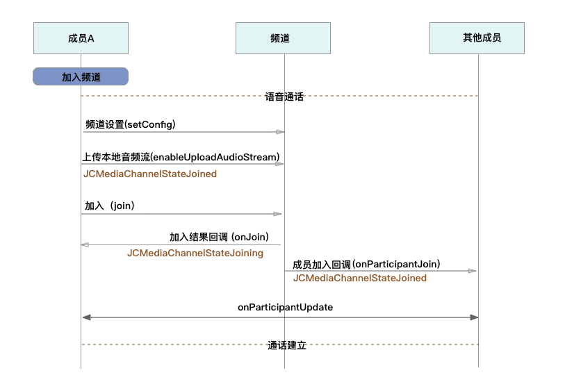
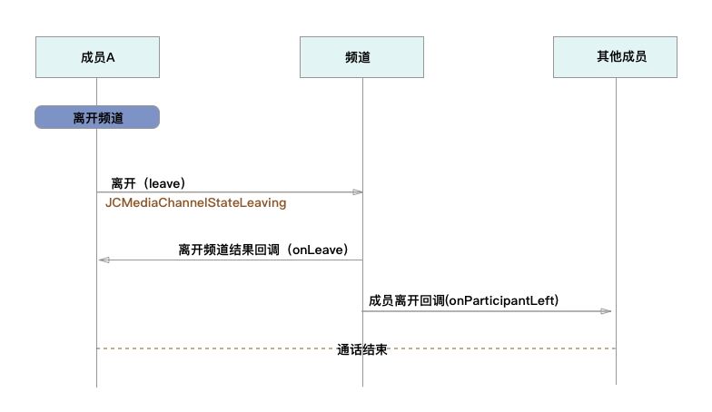

Windows
============================

.. _多方通话-windows:

.. highlight:: csharp

业务集成
------------------------------

准备工作
>>>>>>>>>>>>>>>>>>>>>>>>>>>>>>>>>

开始之前，请您先做好如下准备工作：

- `Windows SDK 下载 <http://developer.juphoon.com/document/cloud-communication-windows-sdk#2>`_

- :ref:`Windows SDK 配置和初始化<Windows SDK 配置和初始化>`

- :ref:`Windows 登录<Windows 登录>`

如果您已经做好相关准备工作，即可继续以下的内容。

业务集成
>>>>>>>>>>>>>>>>>>>>>>>>>>>>>>>>>

**相关类说明**

多方通话涉及以下类：

.. list-table::
   :header-rows: 1

   * - 名称
     - 描述
   * - JCMediaChannel
     - 媒体频道模块，类似音视频房间的概念，可以通过频道号加入此频道，从而进行音视频通话
   * - JCMediaChannelParticipant
     - 媒体频道成员
   * - JCMediaChannelCallback
     - 回调接口
   * - JCMediaDevice
     - 设备模块
   * - JCMediaDeviceVideoCanvas
     - 视频对象
   * - JCMediaChannelQueryInfo
     - 媒体频道查询信息结果

关于类的详细信息请参考 `API 说明文档 <http://developer.juphoon.com/portal/reference/windows/html/c134a0d9-74d2-4872-28ed-5b62b207aa8c.htm>`_ 。

**开始集成多方通话功能前，请先进行** ``模块的初始化``
::

    // 初始化各模块，因为这些模块实例将被频繁使用，建议声明在单例中
    JCClient client = JCClient.create(app, "your appkey", this, null);           
    JCMediaDevice mediaDevice = JCMediaDevice.create(client, this);             
    JCMediaChannel mediaChannel = JCMediaChannel.create(client, mediaDevice, this);

其中，创建 JCMediaChannel 实例的方法如下
::

    /// 

    /// 创建JCMediaChannel对象
    /// 

    /// <param name="client"> JCClient 对象</param>
    /// <param name="mediaDevice">JCMediaDevice 对象</param>
    /// <param name="callback">JCMediaChannelCallback 对象，用于接收JCMediaDevice通知</param>
    /// <returns>JCMediaChannel对象</returns>
    public static JCMediaChannel create(JCClient.JCClient client, JCMediaDevice.JCMediaDevice mediaDevice, JCMediaChannelCallback callback)

**开始集成**

**1. 加入频道**

**场景一 ：语音通话**

- 频道设置

加入频道之前可以调用下面的接口进行频道最大人数的设置
::

    /// 

    /// 设置相关配置参数
    /// 

    /// <param name="key">参数关键字，见JCMediaChannelConstants</param>
    /// <param name="value">参数值</param>
    /// <returns>返回true表示设置成功，false表示设置失败</returns>
    public bool setConfig(string key, string value)

其中，参数 key 请参考 :ref:`配置参数<配置参数(windows)>`。

- 发送本地音频流

在加入频道时，SDK 会 **自动打开音频设备**，因此可以在加入频道之前直接调用 enableUploadAudioStream 方法打开或关闭“上传音频”的标识，这样加入频道后其他成员就可以听到您的声音
::

    /// 

    /// 开启关闭发送本地音频流
    /// 1.在频道中将会与服务器进行交互，服务器会更新状态并同步给其他用户
    /// 2.未在频道中则标记是否上传音频流，在Join时生效
    /// 2.建议每次Join前设置
    /// 

    /// <param name="enable">开启关闭本地音频流</param>
    /// <returns>返回true表示调用成功，false表示调用失败</returns>
    public bool enableUploadAudioStream(bool enable)

.. note:: 

        在多方通话中，enableUploadAudioStream 的作用是设置“是否发送音频流数据”，此方法可以在加入频道前调用，也可以在加入频道后调用。
         - 如果在加入频道前调用，**只是打开或关闭“上传音频”的标识，但不会发送数据**，当加入频道成功时会根据 enableUploadAudioStream 设定的值来确定是否上传音频数据。同时，频道中的其他成员会收到该成员“是否上传音频“的状态变化回调（onParticipantUpdate）。
         - 如果在加入频道后调用，则会开启或者关闭发送本地音频流数据，服务器也会根据 enableUploadAudioStream 设定的值来确定是否上传音频数据。同时，频道中的其他成员会收到该成员“是否上传音频“的状态变化回调（onParticipantUpdate）。
        此外，此方法还可以实现开启或关闭静音的功能。当 enable 值为 false ，将会停止发送本地音频流，此时其他成员将听不到您的声音，从而实现静音功能

要实现语音通话，需要通过下面的接口将发送本地视频流(enableUploadVideoStream)设置为 false 
::

    /// 

    /// 开启关闭发送本地视频流
    /// 1.在频道中将会与服务器进行交互，服务器会更新状态并同步给其他用户
    /// 2.未在频道中则标记是否上传视频流，在Join时生效
    /// 2.建议每次Join前设置
    /// 

    /// <param name="enable">开启关闭本地视频流</param>
    /// <returns>返回true表示调用成功，false表示调用失败</returns>
    public bool enableUploadVideoStream(bool enable)

.. note:: 

    在多方通话中，enableUploadVideoStream 的作用是设置“是否上传视频流数据”，可以在加入频道前调用，也可以在加入频道后调用；
     - 如果在加入频道前调用，**只是打开或关闭“上传视频流”的标识，但不发送数据**，当加入频道后会根据 enableUploadVideoStream 设定的值来确定是否上传视频流数据。同时，频道中的其他成员会收到该成员”是否上传视频“的状态变化回调（onParticipantUpdate）。如果设定的值为 false，则在加入频道后自动开启语音通话模式。
     - 如果在加入频道后调用，则会开启或关闭发送本地视频流数据。服务器会根据 enableUploadVideoStream 设定的值来确定是否上传视频流数据。同时，频道中的其他成员会收到该成员”是否上传视频“的状态变化回调（onParticipantUpdate），从而进行语音通话和视频通话的切换。
    此外，调用该方法发送本地视频流数据还要依赖摄像头是否已经打开。

- 加入频道

::

    /// 

    /// 加入频道
    /// 

    /// <param name="channelIdOrUri">频道标识或频道Uri</param>
    /// <param name="joinParams">加入会议参数（设置cdn,录制,通道密码，最大分辨率，会议URI方式加入会议模式等）</param>
    /// <returns>返回true表示调用成功，false表示调用失败</returns>
    public bool join(string channelIdOrUri, Dictionary<string,string>joinParams)

其中，JoinParam 参数列表如下：

.. list-table::
   :header-rows: 1

   * - 名称
     - 描述
   * - JOIN_PARAM_CDN = "cdn"
     - CDN 地址参数
   * - JOIN_PARAM_RECORD = "record"
     - 音视频录制参数，包括"BucketName", "SecretKey","AccessKey"和"FileKey",参数值通过在七牛云注册获得
   * - JOIN_PARAM_PASSWORD = "password"
     - 密码
   * - JOIN_PARAM_MAX_RESOLUTION = "maxResolution"
     - 最大分辨率，支持 360p、720p、1080p
   * - CONFIG_SMOOTH_MODE = "SmoothMode"
     - 设置平滑模式，降低视频质量确保弱网环境下视频流畅

.. note:: 加入频道会自动打开音频设备。

**示例代码**

::

    // 设置频道人数
    mediaChannel.setConfig(JCMediaChannelConstants.JCMediaChannelConfigCapacity, "6");
    // 发送本地音频流
    mediaChannel.enableUploadAudioStream(true);
    // 停止发送本地视频流
    mediaChannel.enableUploadVideoStream(false);
    // 加入频道
    mediaChannel.join("channelId", null);

加入频道结果回调
::

    /// 

    /// 加入频道结果回调
    /// 

    /// <param name="result">true表示加入成功，false表示加入失败</param>
    /// <param name="reason">加入失败原因，在result为false时该值有效</param>
    /// <param name="channelId">媒体频道标识</param>
    void onJoin(bool result, JCMediaChannelReason reason, string channelId);

示例代码::

    // 加入频道结果回调
    public void onJoin(bool result, JCMediaChannelReason reason, string channelId)
    {
        if (result)
        {
            // 加入频道成功
        } else {
            // 加入频道失败
        }
    }

现在您可以开始多方语音通话了。

^^^^^^^^^^^^^^^^^^^^^^^^^^^^^^^^^^^^

**场景二 ：视频通话**

.. image:: multivideocall.png

- 频道设置

加入频道之前可以调用下面的接口进行频道最大人数的设置
::

    /// 

    /// 设置相关配置参数
    /// 

    /// <param name="key">参数关键字，见JCMediaChannelConstants</param>
    /// <param name="value">参数值</param>
    /// <returns>返回true表示设置成功，false表示设置失败</returns>
    public bool setConfig(string key, string value)

其中，参数 key 请参考 :ref:`配置参数<配置参数(windows)>`。

- 发送本地音频流

在加入频道时，SDK 会 **自动打开音频设备**，因此可以在加入频道之前直接调用 enableUploadAudioStream 方法打开或关闭“上传音频”的标识，这样加入频道后其他成员就可以听到您的声音
::

    /// 

    /// 开启关闭发送本地音频流
    /// 1.在频道中将会与服务器进行交互，服务器会更新状态并同步给其他用户
    /// 2.未在频道中则标记是否上传音频流，在Join时生效
    /// 2.建议每次Join前设置
    /// 

    /// <param name="enable">开启关闭本地音频流</param>
    /// <returns>返回true表示调用成功，false表示调用失败</returns>
    public bool enableUploadAudioStream(bool enable)

.. note:: 

        在多方通话中，enableUploadAudioStream 的作用是设置“是否发送音频流数据”，此方法可以在加入频道前调用，也可以在加入频道后调用。
         - 如果在加入频道前调用，**只是打开或关闭“上传音频”的标识，但不会发送数据**，当加入频道成功时会根据 enableUploadAudioStream 设定的值来确定是否上传音频数据。同时，频道中的其他成员会收到该成员“是否上传音频“的状态变化回调（onParticipantUpdate）。
         - 如果在加入频道后调用，则会开启或者关闭发送本地音频流数据，服务器也会根据 enableUploadAudioStream 设定的值来确定是否上传音频数据。同时，频道中的其他成员会收到该成员“是否上传音频“的状态变化回调（onParticipantUpdate）。
        此外，此方法还可以实现开启或关闭静音的功能。当 enable 值为 false ，将会停止发送本地音频流，此时其他成员将听不到您的声音，从而实现静音功能

- 发送本地视频流

在加入频道前可以调用下面的方法打开或关闭“上传视频流”的标识，如果想看到视图画面，需要在加入频道后手动调用打开摄像头的接口
::

    /// 

    /// 开启关闭发送本地视频流
    /// 1.在频道中将会与服务器进行交互，服务器会更新状态并同步给其他用户
    /// 2.未在频道中则标记是否上传视频流，在Join时生效
    /// 2.建议每次Join前设置
    /// 

    /// <param name="enable">开启关闭本地视频流</param>
    /// <returns>返回true表示调用成功，false表示调用失败</returns>
    public bool enableUploadVideoStream(bool enable)

.. note:: 

    在多方通话中，enableUploadVideoStream 的作用是设置“是否上传视频流数据”，可以在加入频道前调用，也可以在加入频道后调用；
     - 如果在加入频道前调用，**只是打开或关闭“上传视频流”的标识，但不发送数据**，当加入频道后会根据 enableUploadVideoStream 设定的值来确定是否上传视频流数据。同时，频道中的其他成员会收到该成员”是否上传视频“的状态变化回调（onParticipantUpdate）。如果设定的值为 false，则在加入频道后自动开启语音通话模式。
     - 如果在加入频道后调用，则会开启或关闭发送本地视频流数据。服务器会根据 enableUploadVideoStream 设定的值来确定是否上传视频流数据。同时，频道中的其他成员会收到该成员”是否上传视频“的状态变化回调（onParticipantUpdate），从而进行语音通话和视频通话的切换。
    此外，调用该方法发送本地视频流数据还要依赖摄像头是否已经打开。

- 加入频道

::

    /// 

    /// 加入频道
    /// 

    /// <param name="channelIdOrUri">频道标识或频道Uri</param>
    /// <param name="joinParams">加入会议参数（设置cdn,录制,通道密码，最大分辨率，会议URI方式加入会议模式等）</param>
    /// <returns>返回true表示调用成功，false表示调用失败</returns>
    public bool join(string channelIdOrUri, Dictionary<string,string>joinParams)

其中，JoinParam 参数列表如下：

.. list-table::
   :header-rows: 1

   * - 名称
     - 描述
   * - JOIN_PARAM_CDN = "cdn"
     - CDN 地址参数
   * - JOIN_PARAM_RECORD = "record"
     - 音视频录制参数，包括"BucketName", "SecretKey","AccessKey"和"FileKey",参数值通过在七牛云注册获得
   * - JOIN_PARAM_PASSWORD = "password"
     - 密码
   * - JOIN_PARAM_MAX_RESOLUTION = "maxResolution"
     - 最大分辨率，支持 360p、720p、1080p
   * - CONFIG_SMOOTH_MODE = "SmoothMode"
     - 设置平滑模式，降低视频质量确保弱网环境下视频流畅

.. note:: 加入频道会自动打开音频设备。

**示例代码**

::

    // 设置频道人数
    mediaChannel.setConfig(JCMediaChannelConstants.JCMediaChannelConfigCapacity, "6");
    // 发送本地音频流
    mediaChannel.enableUploadAudioStream(true);
    // 发送本地视频流
    mediaChannel.enableUploadVideoStream(true);
    // 加入频道
    mediaChannel.join("channelId", null);

加入频道结果回调
::

    /// 

    /// 加入频道结果回调
    /// 

    /// <param name="result">true表示加入成功，false表示加入失败</param>
    /// <param name="reason">加入失败原因，在result为false时该值有效</param>
    /// <param name="channelId">媒体频道标识</param>
    void onJoin(bool result, JCMediaChannelReason reason, string channelId);

示例代码::

    // 加入频道结果回调
    public void onJoin(bool result, JCMediaChannelReason reason, string channelId)
    {
        if (result)
        {
            // 加入频道成功
        } else {
            // 加入频道失败
        }
    }

- :ref:`创建本地视图画面<创建本地视图画面(windows)>`

加入频道后，如果想看到本地视图画面，需要打开摄像头以创建视图画面。

创建视图画面需要用到 :ref:`JCMediaDevice<JCMediaDevice(windows)>` 类和 :ref:`JCMediaDeviceVideoCanvas<JCMediaDeviceVideoCanvas(windows)>` 类。

进行视图渲染前可通过 :ref:`获取摄像头列表<获取摄像头列表(windows)>` 接口获取摄像头列表。

本地视图渲染调用 JCMediaDevice 类中的 :ref:`startCameraVideo<创建本地视图画面(windows)>` 接口，**该接口会打开摄像头**
::

    /// 

    /// 获取预览视频对象，通过此对象能获得视图用于UI显示
    /// 

    /// <param name="camera">摄像头对象</param>
    /// <param name="mode">渲染方式</param>
    /// <returns>JCMediaDeviceVideoCanvas对象</returns>
    public JCMediaDeviceVideoCanvas startCameraVideo(JCMediaDeviceCamera camera, JCMediaDeviceRenderMode mode)

示例代码::

    // 获取摄像头列表
    List<JCMediaDeviceCamera> cameraDevices = mediaDevice.cameraDevices;
    // 创建本地视频画面对象
    JCMediaDeviceVideoCanvas localCanvas = mediaDevice.startCameraVideo(cameraDevices[0], JCMediaDevice.JCMediaDeviceRenderMode.FULLCONTENT);  
    ImageBrush image = new ImageBrush(localCanvas.videoView);
    image.Stretch = Stretch.Uniform;
    this.label.Background = image;

- :ref:`创建远端视图画面<创建远端视图画面(windows)>`

当新成员加入频道后，其他成员会收到成员加入的回调
::

    /// 

    /// 成员加入回调
    /// 

    /// <param name="participant">成员对象</param>
    void onParticipantJoin(JCMediaChannelParticipant participant);

此时可以进行远端视图渲染并请求远端成员的视频流。

远端视频渲染

远端渲染调用 :ref:`startVideo<创建远端视图画面(windows)>` 获取视频对象
::

    /// 

    /// 获得视频对象，通过此对象能获得视图用于UI显示
    /// 

    /// <param name="videoSource">渲染标识串，比如JCMediaChannelParticipant JCCallItem中的renderId</param>
    /// <param name="mode">渲染模式</param>
    /// <returns>JCMediaDeviceVideoCanvas对象</returns>
    public JCMediaDeviceVideoCanvas startVideo(string videoSource, JCMediaDeviceRenderMode mode)

其中，渲染模式（JCMediaDeviceRender)请参考 :ref:`渲染模式<渲染模式(windows)>`。

- 请求远端成员视频流

由于服务器默认是不转发视频数据的，所以如果想看到远端成员画面需要调用 requestVideo 接口请求远端成员的视频流
::
   
    /// 

    /// 请求频道中的其他用户视频流
    /// 当pictureSize为None表示关闭请求
    /// 

    /// <param name="participant">用户对象</param>
    /// <param name="pictureSize">视频请求尺寸类型</param>
    /// <returns>返回true表示调用成功，false表示调用失败</returns>
    public bool requestVideo(JCMediaChannelParticipant participant, JCMediaChannelPictureSize pictureSize)

其中，视频尺寸（JCMediaChannelPictureSize）有以下几种：

.. list-table::
   :header-rows: 1

   * - 名称
     - 描述
   * - None
     - 不请求
   * - Min
     - 最小尺寸，160x90
   * - Small
     - 小尺寸，320x180，小窗口模式下可以使用小尺
   * - Large
     - 大尺寸，640x360
   * - Max
     - 最大尺寸，360P 的会议为 640x360 ，720P 的会议为 1280x720

.. note:: 您可以根据相应的窗口大小使用相应的视频尺寸，比如窗口的大小是 160x90，则应该使用 JCMediaChannelPictureSizeMin，避免造成不必要的流量浪费和额外的功耗。

现在您可以开始多方视频通话了。

示例代码::

    // 成员加入回调
    public void onParticipantJoin(JCMediaChannelParticipant participant) {
        // 创建远端视频画面对象，renderId来源JCMediaChannelParticipant对象
        List<JCMediaChannelParticipant> partps = mediaChannel.getParticipants();
        JCMediaChannelParticipant item = partps.get(0);
        String renderId = item.renderId;
        JCMediaDeviceVideoCanvas remoteCanvas = mediaDevice.startVideo(renderId, JCMediaDevice.JCMediaDeviceRenderMode.FULLSCREEN);
        ImageBrush image = new ImageBrush(remoteCanvas.videoView);
        image.Stretch = Stretch.Uniform;
        this.label.Background = image;
        // 请求远端视频流，participant为JCMediaChannelParticipant对象
        mediaChannel.requestVideo(participant, JCMediaChannelPictureSize.Large);
    }

^^^^^^^^^^^^^^^^^^^^^^^^^^^^^^^^^^^^^^^^^^

**2. 离开频道**

如果想离开频道，可以调用下面的接口
::

    /// 

    /// 离开频道
    /// 

    /// <returns>返回true表示调用成功，false表示调用失败</returns>
    public bool leave()

示例代码::

    // 离开频道
    mediaChannel.leave();

离开频道后，UI 监听回调离开的原因
::

    /// 

    /// 离开频道结果标识
    /// 

    /// <param name="reason">离开原因</param>
    /// <param name="channelId">媒体频道标识</param>
    void onLeave(JCMediaChannelReason reason, string channelId);

离开原因枚举值请参考 `JCMediaChannelReason <http://developer.juphoon.com/portal/reference/windows/html/4481d778-9d4d-43fe-f94d-fdfa690dd939.htm>`_。

示例代码::

    public void onLeave(JCMediaChannelReason reason, string channelId)
    {
    // 频道号 channelId ，原因 reason
    }

如果是多方视频通话，则在离开频道后还需要调用 :ref:`stopVideo<销毁本地和远端视图画面(windows)>` 接口移除视频画面
::

    /// 

    /// 停止视频
    /// 

    /// <param name="canvas">JCMediaDeviceVideoCanvas对象，由startVideo获得</param>
    public void stopVideo(JCMediaDeviceVideoCanvas canvas)

**解散频道**

.. image:: stopchannel.png

如果想解散频道，可以调用下面的接口，此时所有成员都将被退出
::

    /// 

    /// 结束频道，所有成员都将被退出
    /// 

    /// <returns>返回true表示调用成功，false表示调用失败</returns>
    public bool stop()

示例代码::

    // 结束频道
    mediaChannel.stop();

关闭频道的结果通过 onStop 回调
::

    /// 

    /// 解散频道结果回调
    /// 

    /// <param name="result">true 表示成功，false 表示失败</param>
    /// <param name="reason">解散失败原因，当 result 为 false 时该值有效</param>
    void onStop(bool result, JCMediaChannelReason reason);

**更多功能**

- :ref:`视频采集和渲染<视频采集和渲染(Windows)>`

- :ref:`设备控制<设备控制(Windows)>`

- :ref:`通话状态更新<通话状态更新(Windows)>`

- :ref:`通话过程控制<通话过程控制(Windows)>`

**进阶**

在实现音视频通话的过程中，您可能还需要添加以下功能来增强您的应用：

- :ref:`查询频道<查询频道(windows)>`
- :ref:`桌面或窗口共享<屏幕共享(windows)>`
- :ref:`CDN 推流<CDN 推流(windows)>`
- :ref:`音视频录制<音视频录制(windows)>`
- :ref:`发送消息<发送消息(windows)>`
- :ref:`发送指令<发送指令(windows)>`
