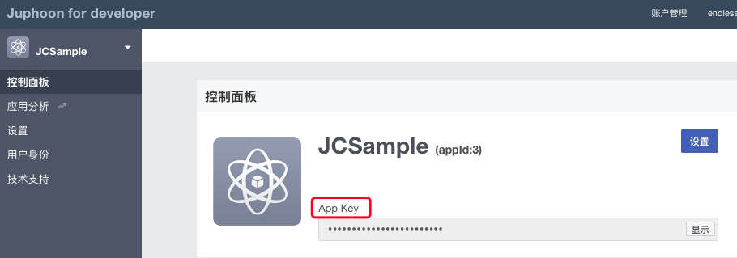
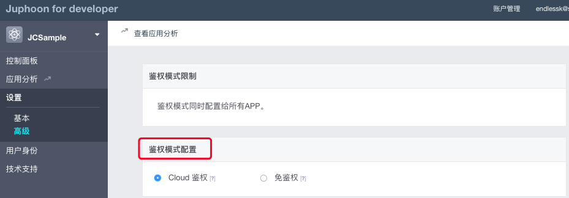

新手入门
==================================

.. toctree::
   :maxdepth: 2

简介
----------------------------

菊风云通讯平台为开发者提供 ``通话、会议、消息、群组、文件共享、涂鸦`` 等通讯云服务。

随着互联网技术的飞速发展，音视频通话已经成为现代生活中不可或缺的沟通方式，如何提升用户的通话体验是众多企业关注的焦点，而菊风专注于音视频通讯领域的研究已有十几年，并积累了丰富的经验，在音视频 QoS 处理、音视频编解码方面成效卓越。
菊风开发的 SDK 软件开发包大大简化了音视频会话应用开发的研发过程。开发者只需要使用开发包封装的简洁、清晰的 API，便能快速开发具有优异性能的音视频会话业务。
菊风云通讯平台正是基于 SDK 软件开发包为用户提供一对一通话、多方通话、即时消息、涂鸦、群组管理等丰富的功能。

接入流程
----------------------------

1.了解菊风云通讯平台的产品和服务

 - :ref:`产品介绍<产品介绍>`

 - :ref:`产品优势<产品优势>`

 - :ref:`应用场景<应用场景>`

2.注册账号

.. _注册成为开发者:

开始之前请先 `注册成为开发者 <http://developer.juphoon.com/signup>`_ 。

如果您已经拥有开发者帐号，请直接 `登录 <http://developer.juphoon.com/signin>`_ ，并开始创建您的应用。

登录之后，您可以通过 Juphoon Cloud Platform 开发者帐号使用开发者工具和创建应用。

.. _创建应用:

3.创建应用

登录开发者帐号后，点击 “添加应用”，输入应用名称以创建应用。

.. image:: images/appcreate1.png

.. note:: 应用名称创建后不可修改。

创建完成后，系统会自动为您的应用生成 **AppKey**。

点击 “显示" 即可以看到 AppKey。

**AppKey 是应用在 Juphoon Cloud Platform 中的唯一标识。** 更多关于 AppKey 的信息请参阅 :ref:`AppKey 说明<AppKey 说明>`。

应用创建完成后，即可对应用进行设置，应用设置包括基本设置和高级设置。在高级设置中，您可以进行“鉴权模式配置”，包括 Cloud 鉴权和免鉴权，详细了解请参阅 :ref:`登录模式说明 <登录模式说明>` 中的相关内容。 

4.客户端集成

- :ref:`SDK 下载<SDK 下载>`

- :ref:`SDK 配置和初始化<SDK 配置和初始化>`

- :ref:`登录<登录>`

- 业务集成

  - :ref:`一对一通话<一对一通话>`

  - :ref:`多方通话<多方通话>`

  - :ref:`WebRTC 通话<WebRTC 通话>`

  - :ref:`SIP 电话<SIP 电话>`

  - :ref:`推送<推送>`

  - :ref:`涂鸦<涂鸦>`

  - :ref:`即时消息<即时消息>`

  - :ref:`群组<群组>`

  - :ref:`文件存储<文件存储>`

体验 Demo
----------------------------

Juphoon Cloud Platform SDK 支持各主要开发平台，并提供终端的 Demo 帮助您评估和集成我们的 SDK。

请点击 :ref:`体验 Demo<体验 Demo>` 进入 Demo 体验页面。

Demo 支持以下平台：

- ``iOS：8.0 及以上系统``

- ``Android：4.0 及以上系统``

- ``Windows：XP 及以上系统 （Demo 运行需要 .net framwork 4.5)``
