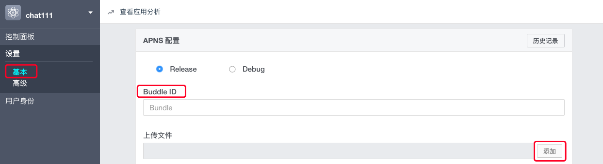

iOS 推送
=============================

.. _iOS 推送:

简介
---------------------

由于苹果不支持后台 App 的长链接，所以当 App 处于后台或者被杀掉的情况下将无法收到音视频的呼叫，因此在这种情况下需借助 Push 机制来接收音视频呼叫。Push 的目的是唤醒 App，使其与 Juphoon Cloud Platform 服务器建立连接，以接收服务器消息。

iOS 推送分为 APNs 推送和 VoIP 推送，此处介绍 VoIP 推送的集成方法。

VoIP（全称 voice-over-IP) Push Notifications 是苹果为 iOS 8 及以上的版本引入的一个新的推送类型。VoIP 推送可以在用户收到来电时唤醒 APP，从而不需要让 APP 持续保持后台运行，这将帮助减少数据使用从而改善电池的使用寿命，而且能够优化 VoIP 的体验，增加接通率。**苹果建议 VoIP App 使用 VoIP Push 来代替传统的 APNs。**

**VoIP 推送过程**

通过在应用提供商和应用程序中进行推送通知设置，应用的提供商可以向 VoIP 发送通知请求。VoIP 将向每个目标设备传送相应的推送消息。当收到通知后，系统会将推送消息传送到设备上的相应应用程序中。

更多关于 VoIP 推送的信息请参考 `苹果开发指南 <https://developer.apple.com/library/content/documentation/NetworkingInternet/Conceptual/RemoteNotificationsPG/APNSOverview.html#//apple_ref/doc/uid/TP40008194-CH8-SW1>`_ 。

^^^^^^^^^^^^^^^^^^^^^^^^^

VoIP 推送集成
--------------------------

集成流程
>>>>>>>>>>>>>>>>>>>>>>>>>

- deviceToken 是 APP 在设备上的标识符，即每个APP在每一个不同的设备上都有着不同的 deviceToekn，通过注册 VoIP 远程推送服务，VoIP 会返回 APP 的 deviceToken。

- APP 将接收到的 deviceToken 发送给 Juphoon Push 服务，当 Juphoon Push 服务向 Apple 的 VoIP 服务器发送推送消息时，VoIP 就可以通过 deviceToken 向特定的设备推送消息。

Juphoon Cloud Platform 集成 VoIP Push 主要有以下几步：

1. VoIP 证书申请
>>>>>>>>>>>>>>>>>>>>>>>>>

VoIP 证书申请有两种方式：

一、从苹果开发者网站获取证书

 1> 登录 `苹果开发者网站 <https://developer.apple.com>`_

 2> 进入 "Certificates, Identifiers & Profiles" 页面

 .. image:: images/platform_push_ios_certificates.png

 3> 点击右上角 "+" 按钮进入下一步

 .. image:: images/platform_push_ios_addCert.png

 4> 选择 **VoIP Services Certificate** 然后点击 "continue"

 .. image:: images/platform_push_ios_VoipCert.png

 5> 选择证书要对应的 AppId 然后点击 "continue"

 .. image:: images/platform_push_ios_chooseAppId.png

 6> 根据说明 **创建证书请求文件** 然后点击 "continue"。其中 **创建证书请求文件** 步骤如下：

    a. 打开钥匙串应用

    .. image:: images/platform_push_ios_keychain.png

    b. 点击 "从证书颁发机构请求证书"

    .. image:: images/platform_push_ios_keychainRequest.png

    c. 填写邮箱等信息后(不要填中文)生成证书请求文件

    .. image:: images/platform_push_ios_keychainGen.png

 7> 上传 **生成的证书请求文件** 然后点击生成

 .. image:: images/platform_push_ios_uploadCert.png

 8> 点击下载证书文件到本地

 .. image:: images/platform_push_ios_downloadCert.png

 9> 双击证书文件添加到钥匙串，并导出为 p12 文件

 .. image:: images/platform_push_ios_VoipSavePem.png

二、利用终端生成 VoIP 证书

 具体命令如下：

 ::

    openssl pkcs12 -in voip.p12 -out voipselfcert.pem -nodes -clcerts -nokeys

    openssl pkcs12 -in voip.p12 -out voipselfkey.pem -nodes -nocerts

    openssl rsa -in voipselfkey.pem -out voipselfras.pem

    cat voipselfcert.pem  voipselfras.pem  > voipselfmerge.pem（要上传的文件）

2. 上传 VoIP 证书
>>>>>>>>>>>>>>>>>>>>>>>>>

VoIP 证书申请之后，登录菊风云控制台进行对应的设置，具体如下：

- 登录菊风云控制台，进入要进行推送设置的应用详情，找到 Push 设置里的 APNS 配置

- 推送设置分为 Release 和 Debug，其中 Release 用于苹果正式环境；Debug 用于开发环境。

下面以 AppId 为 com.juphoon.cloud.JCSample 为例，分别添加上述两种模式证书，证书均为上述第 9 步生成的 pem。

Release 的 Bundle 为 com.juphoon.cloud.JCSample.VOIP

Debug 的 Bundle 为 com.juphoon.cloud.JCSample.VOIP.DEBUG

3. 配置 VoIP 推送
>>>>>>>>>>>>>>>>>>>>>>>>>

证书上传完成后，需要在工程中配置 :ref:`VOIP_PUSH_DEBUG 的宏定义<voipset>`。

.. note::

        VOIP_PUSH_DEBUG 宏定义的目的是为了区分推送环境是 release 还是 debug，环境不对会导致推送失败。

4. 代码集成
>>>>>>>>>>>>>>>>>>>>>>>>>

.. highlight:: objective-c

完成以上步骤即可进行代码集成，具体如下：

1. 创建 JCPush 对象

::

    /**
     *  @brief 创建 JCPush 对象
     *  @param client JCClient 对象
     *  @return 返回 JCPush 对象
     */
    +(JCPush*)create:(JCClient*)client;

示例代码::

    JCClient *client = [JCClient create:@"your appkey" callback:self extraParams:nil];
    JCPush *push = [JCPush create:client];

2. 注册 VoIP Push

- 注册 VoIP Push 通知

 必须在登录成功后注册，JCSample 中是在收到登录成功的回调中注册的，具体参考 JCManager.m 文件

::

    -(void)onLogin:(bool)result reason:(JCClientReason)reason
    {
        if (result) {
            [[NSNotificationCenter defaultCenter] postNotificationName:kClientOnLoginSuccessNotification object:nil];
        
            UIUserNotificationSettings *userNotifySetting = [UIUserNotificationSettings 
                settingsForTypes:UIUserNotificationTypeBadge | UIUserNotificationTypeSound | 
                UIUserNotificationTypeAlert categories:nil];
            [[UIApplication sharedApplication] registerUserNotificationSettings:userNotifySetting];
            
            dispatch_queue_t mainQueue = dispatch_get_main_queue();
            PKPushRegistry * voipRegistry = [[PKPushRegistry alloc] initWithQueue: mainQueue];
            voipRegistry.delegate = self;
            voipRegistry.desiredPushTypes = [NSSet setWithObject:PKPushTypeVoIP];
        }
    }

- 调用接口进行推送注册

 您可以调用下面的接口设置苹果服务器获取的 token、设置通话推送信息、设置消息推送信息、添加推送模板

- 设置苹果服务器获取的 token

::

    /**
     *  @brief 设置苹果服务器获取的token
     *  @param deviceToken token 值
     *  @param voip 是否是 voip token
     *  @param debug 是否是 debug 模式
    */
    -(id)initWithToken:(NSData*)deviceToken voip:(bool)voip debug:(bool)debug;

.. note:: debug 参数值需要依据开发环境而定，发布版设置为 false，开发版设置为 true。

- 设置通话推送信息
::

    /**
     *  @brief 设置通话推送信息
     *  @param sound 声音资源，例如 ring.m4r，为 nil 时则用默认声音
     *  @param seconds 消息过期时间
     */
    -(id)initWithCall:(NSString*)sound expiration:(int)seconds;

- 设置消息推送信息
::

    /**
     *  @brief 设置消息推送信息
     *  @param infoType 消息类型
     *  @param tip 提示内容，不包含发送者，例如 “xx:发送了条消息”，其中"发送了条消息"为tip值，如果要提示发送内容，则填 nil
     *  @param sound 声音资源，例如 ring.m4r
     *  @param seconds 消息过期时间
     */
    -(id)initWithText:(NSString*)infoType tip:(NSString*)tip sound:(NSString*)sound expiration:(int)seconds;

.. note::

    tip 为提示内容：
     - 如果 tip 值为空，则会在提示中显示消息详情；
     - 如果 tip 值不为空，则只显示消息的标题。
    例如“xx:发送了条消息”，其中"发送了条消息"为 tip 值。

- 添加推送模板
::

    /**
     *  @brief 添加推送模板，用于服务器将不同类型的推送以不同的内容格式推给客户端
     *  @param info JCPushInfo 对象
     *  @return true 表示成功 false 表示失败
     */
    -(bool)addPushInfo:(JCPushInfo*)info;

示例代码
::

    - (void)pushRegistry:(PKPushRegistry *)registry didUpdatePushCredentials:(PKPushCredentials *)credentials forType:(PKPushType)type
    {
        // 设置苹果服务器获取的token
        [_push addPushInfo:[[JCPushInfo alloc] initWithToken:credentials.token voip:true debug:PushEnv]];
        // 设置通话推送信息
        [_push addPushInfo:[[JCPushInfo alloc] initWithCall:nil expiration:2419200]];
        // 设置消息推送信息
        [_push addPushInfo:[[JCPushInfo alloc] initWithText:@"text" tip:nil sound:nil expiration:2419200]];
    }

注册完成后，当 APNS 服务器推送消息到对应 token 的设备时将会触发下面的回调
::
    
    // 对推送过来的消息进行解析
    - (void)pushRegistry:(PKPushRegistry *)registry didReceiveIncomingPushWithPayload:(PKPushPayload *)payload forType:(PKPushType)type
    {
        // 取到之前设置的Payload
        NSDictionary * dictionary = payload.dictionaryPayload;
        // 界面可以做自定义的处理
        ...
    }

验证 VoIP 推送
>>>>>>>>>>>>>>>>>>>>>>>>>

推送集成后，即可进行验证，具体如下：

1. 使用用户名登录您的 App，登录后将 App 从后台杀掉。

2. 进入 `Juphoon for developer <http://developer.juphoon.com>`_ ->控制台 ->我的应用 ->设置 ->基本 ->验证 Push。

3. 输入用户名和推送内容，点击验证，此时页面应提示“push 信息发送到服务器成功”。

.. image:: images/push_prove.png
