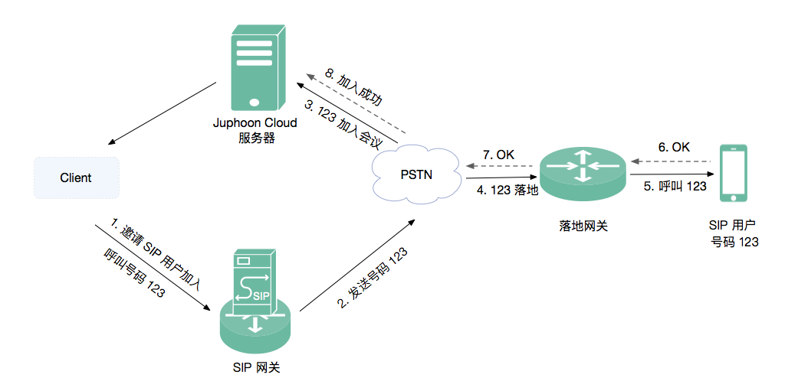

简介
---------------------

利用 Juphoon Cloud Platform SDK 可以轻松实现一对一和多方音视频通话，但是如果出现用户所处的网络条件不好甚至没有网络条件的时候，就可以通过 PSTN 拨打 **SIP 电话** 加入通话。

SIP 电话是通过 PSTN 实现的。PSTN( Public Switched Telephone Network )，也称“落地电话”。那么 PSTN 是如何将 SIP 用户加入通话的呢？

**PSTN 工作原理**

1. Client 终端通过呼叫 SIP 用户号码邀请 SIP 用户加入会议；

2. SIP 网关将 SIP 号码发送给 PSTN；

3. PSTN 收到被邀请 SIP 号码后，登录该账号并加入会议；

4. PSTN 加入会议成功后，向落地网关呼叫被邀请 SIP 号码；

5. 落地网关呼叫 SIP 号码；

6. SIP 用户收到呼叫信息，加入会议并进行通话。

利用 PSTN 可以实现一对一 SIP 语音电话和多方 SIP 语音电话。

了解完 PSTN 的工作机制，下面让我们开始集成 SIP 电话吧。