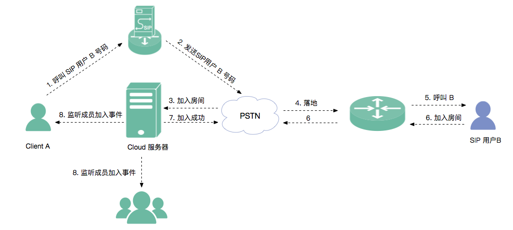

iOS
-------------------------------

.. highlight:: objective-c

**开始集成 Sip 通话功能前，请先进行** ``模块的初始化``
::

    // 初始化各模块，因为这些模块实例将被频繁使用，建议声明在单例中
    JCClient *client = [JCClient create:@"your appkey" callback:self extraParams:nil];
    JCMediaDevice *mediaDevice = [JCMediaDevice create:client callback:self];
    JCMediaChannel *mediaChannel = [JCMediaChannel create:client mediaDevice:mediaDevice callback:self];

其中，创建 JCMediaChannel 实例的方法如下
::

    /**
     *  @brief 创建 JCMediaChannel 对象
     *  @param client       JCClient 对象
     *  @param              mediaDevice JCMediaDevice 对象
     *  @param callback     JCMediaChannelCallback 回调接口，用于接收 JCMediaChannel 相关通知
     *  @return             返回 JCMediaChannel 对象
     */
    +(JCMediaChannel*)create:(JCClient*)client mediaDevice:(JCMediaDevice*)mediaDevice callback:(id<JCMediaChannelCallback>)callback;

**开始集成**

1. 加入通话

::

    /**
     * 加入频道，当前只支持同时加入一个媒体频道
     *  @param channelId 媒体频道标识
     *  @param params Key值参考 JCMediaChannelConfigRecord、JCMediaChannelConfigCdn、
     *                         JCMediaChannelConfigRegion、JCMediaChannelConfigPassword、
     *                         JCMediaChannelConfigMax、JCMediaChannelConfigSmoothMode 没有则为nil
     *  @return 返回 true 表示正常执行调用流程，false 表示调用异常
     */
    -(bool)join:(NSString*)channelId params:(NSMutableDictionary *)params;

.. note:: 加入频道会自动打开音频设备。

示例代码
::

    
    // 加入频道
    [mediaChannel join:@"channelId" params:nil];

Client A 加入之后会收到 onjoin 回调
::

    /**
     *  @brief 加入频道结果回调
     *  @param result true 表示成功，false 表示失败
     *  @param reason 加入失败原因，当 result 为 false 时该值有效
     *  @param channelId 媒体频道标识符
     *  @see JCMediaChannelReason
     */
    -(void)onJoin:(bool)result reason:(JCMediaChannelReason)reason channelId:(NSString*)channelId;

示例代码::

    // 加入频道结果回调
    -(void)onJoin:(bool)result reason:(JCMediaChannelReason)reason channelId:(NSString*)channelId
    {
        if (result) {
          // 加入成功
        } else {
          // 加入失败
        }
    }

Client A 加入成功后，调用 enableUploadAudioStream 方法请求开启发送本地音频流

::

    /**
     *  @brief 开启关闭发送本地音频流
     *      1.在频道中将会与服务器进行交互，服务器会更新状态并同步给其他用户
     *      2.未在频道中则标记是否上传音频流，在join时生效
     *      3.建议每次join前设置
     *  @param enable 是否开启本地音频流
     *  @return 返回 true 表示正常执行调用流程，false 表示调用异常
     */
     -(bool)enableUploadAudioStream:(bool)enable;

示例代码::

    // 发送本地音频流
    [mediaChannel enableUploadAudioStream:true];

2.  邀请 SIP 用户加入通话

Client A 通过 UI 调用 inviteSipUser 接口邀请 SIP 用户 B 加入通话
::

    /**
     * @brief 邀请Sip用户，一般用于对接落地网关等
     *
     * @param userId 一般为号码
     * @param sipParam nil 或者通过 JCMediaChannelUtils.buildSipParam 构造
     * @return 成功返回值 >= 0，失败返回 -1
     */
    -(int)inviteSipUser:(NSString *)userId sipParam:(NSString*)sipParam;

其中，sipParam 构造方法如下
::

    /**
     * @brief sip邀请param参数构造
     *
     * @param sipUri JCMediaChannel.inviteSipUser 参数 userId 是号码还是 sipUri
     * @param route sipUri 为 true 才生效，决定 sip 信令是否路由到 userId 的 sip 域里
     * @param displayName sip用户加入会议后的昵称
     * @param mcu JCMediaChannel.inviteSipUser 参数 userId 是否为 Mcu 会议
     * @param video 是否需要视频接入
     * @param dtmfPassowrd dtmf 密码
     * @return json 字符串
     */
    +(NSString*)buildSipParam:(BOOL)sipUri route:(BOOL)route displayName:(NSString*)displayName mcu:(BOOL)mcu video:(BOOL)video dtmfPassowrd:(NSString*)dtmfPassowrd;

示例代码::

    // 邀请SIP用户加入通话
    [mediaChannel inviteSipUser:@"userId" sipParam:nil];

邀请操作执行后，Client A 将会收到 onInviteSipUserResult 回调
::

    /**
     * 邀请Sip用户操作结果回调，成功后会触发 onParticipantJoin
     *
     * @param operationId 操作id
     * @param result 操作结果 true表示成功，false表示失败
     * @param reason 操作原因
     */
    -(void)onInviteSipUserResult:(int)operationId result:(bool)result reason:(int)reason;

SIP 用户 B 加入成功后，Client A 和频道中的其他成员会收到新成员加入事件（onParticipantJoin）回调
::

    /**
     *  @brief 新成员加入回调
     *  @param participant 成员对象
     */
    -(void)onParticipantJoin:(JCMediaChannelParticipant*)participant;

3. 离开通话

通话结束，Client A 可通过 UI 调用 Leave 接口离开通话，Client A 离开后会收到 onLeave 回调。B 则可以直接挂断以结束通话
::

    /**
     *  @brief 离开媒体通道，当前只支持同时加入一个媒体通道
     *  @return 返回 true 表示正常执行调用流程，false 表示调用异常
     */
    -(bool)leave;

    /**
     *  @brief 离开媒体通道结果回调
     *  @param reason 离开原因
     *  @param channelId 媒体频道标识符
     *  @see JCMediaChannelReason
     */
    -(void)onLeave:(JCMediaChannelReason)reason channelId:(NSString*)channelId;

示例代码::

    // 离开频道
    [mediaChannel leave];

离开原因枚举值请参考 `JCMediaChannelReason <http://developer.juphoon.com/portal/reference/ios/Constants/JCMediaChannelReason.html>`_。

如果 B 先离开通话，则 Client A 和频道中的其他成员将会收到成员离开事件（onParticipantLeft）
::

    /**
     *  @brief 成员离开回调
     *  @param participant 成员对象
     */
    -(void)onParticipantLeft:(JCMediaChannelParticipant*)participant

**通话状态更新**

通话过程中，如果有成员状态发生了改变，则频道中的其他成员会收到 onParticipantUpdate 回调

::

    /**
     *  @brief 成员更新回调
     *  @param participant 成员对象
     */
    -(void)onParticipantUpdate:(JCMediaChannelParticipant*)participant;

**通话过程控制**

- 开启/关闭音频输出

在通话中可以通过下面的方法开启或者关闭音频输出，当 enable 值为 false 时，您将听不到其他成员的声音

::

    /**
     *  @brief 开启关闭音频输出，可实现静音功能，建议每次join前设置
     *  @param enable 是否开启音频输出
     *  @return 返回 true 表示正常执行调用流程，false 表示调用异常
     */
    -(bool)enableAudioOutput:(bool)enable;

- 开启/关闭发送本地音频流

如果想开启或关闭发送本地音频流，可以调用下面方法，当 enable 值为 false ，将会关闭发送本地音频流，此时其他成员将听不到您的声音，从而实现静音功能
::

    /**
     *  @brief 开启关闭发送本地音频流
     *      1.在频道中将会与服务器进行交互，服务器会更新状态并同步给其他用户
     *      2.未在频道中则标记是否上传音频流，在join时生效
     *      3.建议每次join前设置
     *  @param enable 是否开启本地音频流
     *  @return 返回 true 表示正常执行调用流程，false 表示调用异常
     */
    -(bool)enableUploadAudioStream:(bool)enable;

示例代码
::

    // 开启音频输出
    [mediaChannel enableAudioOutput:true];
    // 发送本地音频流
    [mediaChannel enableUploadAudioStream:true];

**设备控制**

- 开启/关闭扬声器
::

    /**
     *  @brief 开启关闭扬声器
     *  @param enable 是否开启
     */
    -(void)enableSpeaker:(bool)enable;

- 开启/关闭音频设备
::

    /**
     *  @brief 启动音频，一般正式开启通话前需要调用此接口
     *  @return 成功返回 true，失败返回 false
     */
    -(bool)startAudio;

    /**
     *  @brief 停止音频，一般在通话结束时调用
     *  @return 成功返回 true，失败返回 false
     */
    -(bool)stopAudio;

示例代码
::

    // 开启关闭扬声器
    [mediaDevice enableSpeaker:true];

    // 关闭音频设备
    [mediaDevice stopAudio];

    // 开启音频设备
    [mediaDevice startAudio]