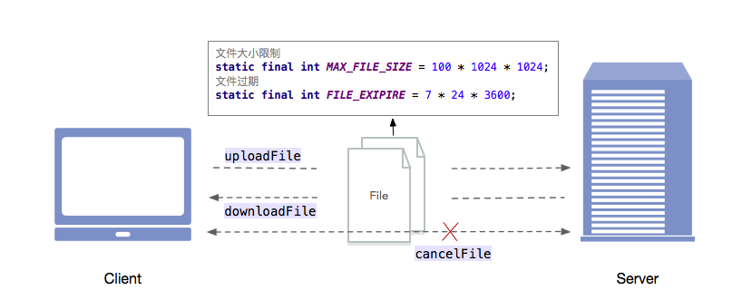

简介
----------------------

文件存储的功能是实现文件的上传和下载。已经上传的文件可以通过 URI 进行下载，并可以通过分享 URI 给其他成员进行文件的下载，从而实现文件共享。

文件存储的基本操作包括上传文件、下载文件以及取消上传和下载文件。文件传输的过程中可以进行文件传输进度的查询和文件状态的更新。

存储模块对上传文件的大小和在服务器中保存的期限有一定的限制。

